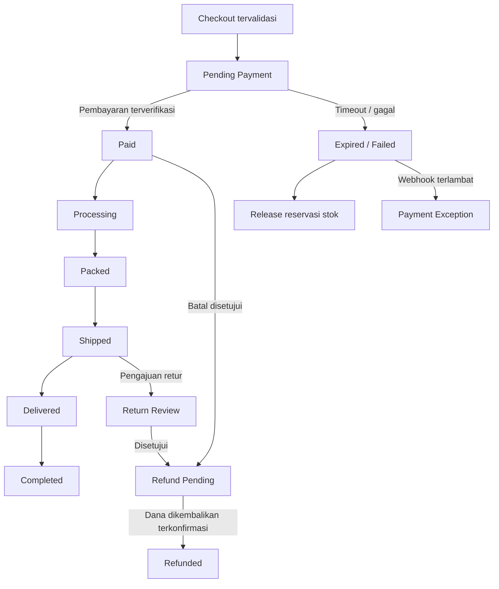
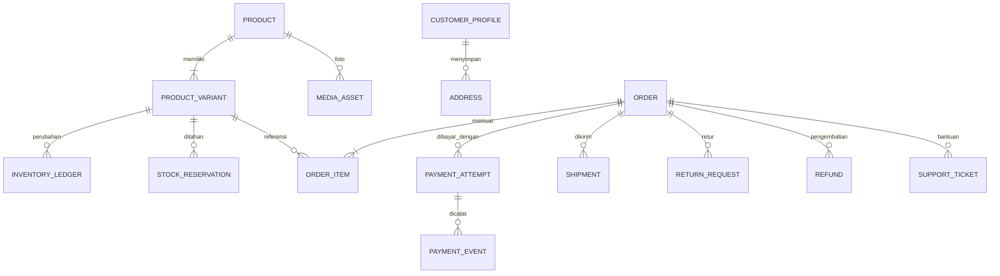

# Product Requirements Document — Daster Tasbon Olshop

> **Status keputusan:** **[DIKONFIRMASI]** Nama brand **Daster Tasbon Olshop**, produk daster dan pakaian wanita lainnya, fulfillment kombinasi, checkout otomatis, pengiriman nasional, **Pakasir API v2** untuk pembayaran, dan **RajaOngkir/Komerce Shipping Cost serta Shipping Delivery**. Arah desain **A — Warm Modern Feminine telah ACC**. Detail origin, kombinasi fulfillment, kurir aktif, ongkir final, penanggung biaya transaksi, SOP dan **hak akses Enterprise Shipping Delivery** masih **[TERBUKA]**. Layanan Pakasir merupakan perantara pembayaran yang menggunakan mitra payment gateway, bukan klaim bahwa Pakasir sendiri penyelenggara gateway berizin.

## Daftar Isi

- [0. Kontrol Dokumen](#0-kontrol-dokumen)
- [1. Ringkasan Eksekutif](#1-ringkasan-eksekutif)
- [2. Visi, Masalah, dan Sasaran](#2-visi-masalah-dan-sasaran)
- [3. Pengguna, Aktor, dan Peran](#3-pengguna-aktor-dan-peran)
- [4. Model Bisnis dan Cakupan](#4-model-bisnis-dan-cakupan)
- [5. Arsitektur Informasi dan Inventaris Layar](#5-arsitektur-informasi-dan-inventaris-layar)
- [6. User Journey dan User Story](#6-user-journey-dan-user-story)
- [7. Kebutuhan Fungsional](#7-kebutuhan-fungsional)
- [8. Aturan Bisnis](#8-aturan-bisnis)
- [9. Status dan Siklus Hidup Transaksi](#9-status-dan-siklus-hidup-transaksi)
- [10. Model Data Konseptual](#10-model-data-konseptual)
- [11. Matriks Hak Akses](#11-matriks-hak-akses)
- [12. Nonfunctional Requirements](#12-nonfunctional-requirements)
- [13. Keamanan, Privasi, dan Kepatuhan](#13-keamanan-privasi-dan-kepatuhan)
- [14. Kebutuhan UX, Konten, dan Aksesibilitas](#14-kebutuhan-ux-konten-dan-aksesibilitas)
- [15. Notifikasi dan Komunikasi](#15-notifikasi-dan-komunikasi)
- [16. Analytics dan KPI](#16-analytics-dan-kpi)
- [17. Operasional, Pelayanan, dan Penanganan Kasus](#17-operasional-pelayanan-dan-penanganan-kasus)
- [18. Integrasi dan Ketergantungan](#18-integrasi-dan-ketergantungan)
- [19. Edge Cases dan Failure Handling](#19-edge-cases-dan-failure-handling)
- [20. Rencana Rilis dan Prioritas](#20-rencana-rilis-dan-prioritas)
- [21. Risiko dan Mitigasi](#21-risiko-dan-mitigasi)
- [22. Acceptance Criteria dan Test Cases](#22-acceptance-criteria-dan-test-cases)
- [23. Traceability Matrix](#23-traceability-matrix)
- [24. Asumsi dan Keputusan Terbuka](#24-asumsi-dan-keputusan-terbuka)
- [25. Handoff ke DESIGN.md dan Google Stitch](#25-handoff-ke-designmd-dan-google-stitch)
- [26. Referensi dan Riwayat Perubahan](#26-referensi-dan-riwayat-perubahan)
- [Lampiran A. Contoh Data dan Konten](#lampiran-a-contoh-data-dan-konten)
- [Lampiran B. Glosarium](#lampiran-b-glosarium)

## 0. Kontrol Dokumen

### 0.1 Tujuan

PRD menetapkan **apa** yang harus dilakukan website, **siapa** yang dilayani, **mengapa** fitur ada, **aturan** yang berlaku, dan **bagaimana** keberhasilannya diuji. Dokumen ini menjadi pegangan pemilik usaha, desainer, engineer, QA, operator, dan layanan pelanggan. Framework dan hosting belum dipilih di PRD ini. Penyedia pembayaran dan logistik **sudah diputuskan oleh owner**; design direction **A — Warm Modern Feminine** juga sudah disetujui.

### 0.2 Status dan pembacaan prioritas

| Kode | Makna |
|---|---|
| **MUST** | Harus berjalan untuk peluncuran MVP yang dapat menerima pesanan secara aman. |
| **SHOULD** | Nilai tinggi, dapat masuk rilis setelah MVP stabil. |
| **COULD** | Opsional jika kapasitas dan bukti kebutuhan mendukung. |
| **WON'T NOW** | Sengaja di luar cakupan versi awal. |

`[DIKETAHUI]`: diberikan pengguna; `[ASUMSI]`: hipotesis perancang; `[USULAN]`: rekomendasi yang dapat diubah; `[TERBUKA]`: keputusan belum dikunci.

### 0.3 Pemilik keputusan dan persetujuan

| Objek | Penanggung jawab | Status |
|---|---|---|
| Brand, identitas hukum, kebijakan jual-beli | Pemilik usaha | Nama brand **Daster Tasbon Olshop** disetujui; identitas hukum dan kebijakan jual-beli masih terbuka |
| Harga, margin, stok, cakupan layanan dan retur | Pemilik usaha | **Sebagian disetujui:** target layanan nasional; detail harga/stock/policy dan area courier belum |
| Validasi alur pelanggan dan prioritas fitur | Pemilik usaha | Checkout website + pembayaran otomatis dikonfirmasi; detail fungsi dan SOP tetap memerlukan UAT |
| Validasi kelayakan keamanan/integrasi | Tech Lead | **Belum ditunjuk** |
| Review kesiapan aturan dan teks legal | Penasihat hukum/operasional terkait | **Belum dilakukan** |

### 0.4 Batasan keputusan

**Rekomendasi utama:** website toko fisik **satu brand/satu pengelola penjualan**, berbahasa Indonesia, IDR, mobile-first, **guest checkout**, dukungan fulfillment kombinasi dengan pengelompokan sumber pengiriman, pembayaran online menggunakan **Pakasir API v2** serta perhitungan ongkir dan pengiriman menggunakan **RajaOngkir/Komerce** untuk alamat di Indonesia. **[ASUMSI]** Semua dapat disesuaikan setelah pemilik memvalidasi model operasional.

## 1. Ringkasan Eksekutif

**Daster Tasbon Olshop** adalah rancangan toko online langsung-ke-konsumen untuk menemukan dan membeli **daster serta pakaian wanita lainnya** **[DIKONFIRMASI CAKUPAN PRODUK]** secara praktis dan tepercaya. Pelanggan dapat menjelajah katalog, memahami bahan dan ukuran, memilih motif/varian, melihat harga dan stok, menghitung total belanja dan ongkir, membayar, serta memantau pesanan. Tim toko dapat mengelola katalog, stok per varian, transaksi, pemenuhan pesanan, pengiriman, promo, pertanyaan pelanggan, dan laporan operasional.

**Value proposition awal [USULAN]:** “Daster dan pilihan busana wanita yang nyaman, informasi ukuran jelas, serta pengalaman belanja sampai pengiriman yang transparan.”

**North-star metric [USULAN]:** jumlah **pesanan berbayar yang terpenuhi** dengan tingkat komplain terkendali. Metrik pendamping: conversion rate, checkout completion, repeat purchase, akurasi stok, ketepatan proses pengiriman.

**MVP siap jual** harus membentuk satu alur penuh: **lihat produk → pilih varian → keranjang → isi alamat → pilih ongkir → bayar → verifikasi → admin proses → nomor resi → selesai**, termasuk kasus gagal/cancel/refund.

## 2. Visi, Masalah, dan Sasaran

### 2.1 Rumusan masalah dan kesempatan [HIPOTESIS]

- Calon pembeli sulit menilai **ukuran, panjang, lingkar dada, bahan, dan motif** dari etalase yang kurang informatif.
- Pembelian melalui chat manual membuat stok, ongkir, pembayaran, dan tindak lanjut pesanan rawan salah.
- Pemilik toko memerlukan etalase yang mengurangi pertanyaan berulang serta pencatatan penjualan yang lebih rapi.
- Website sendiri memungkinkan konsistensi brand dan kepemilikan pengalaman pelanggan, tetapi memerlukan upaya mendatangkan trafik.

### 2.2 Visi

Menjadi pengalaman belanja daster dan pakaian wanita online yang **jelas, mudah, terpercaya, dan menyenangkan** untuk konsumen Indonesia, tanpa membebani pelanggan dengan tahapan yang tidak perlu.

### 2.3 Sasaran produk

| ID | Goal | Ukuran keberhasilan | Kapan dinilai |
|---|---|---|---|
| GOAL-01 | Pembeli mudah menemukan produk cocok | Product discovery-to-detail rate; pencarian berhasil | 30 hari pertama |
| GOAL-02 | Pengalaman belanja berujung pesanan sah | Checkout-to-paid conversion | Mingguan |
| GOAL-03 | Pengelolaan stok dan pesanan akurat | Pesanan oversold; selisih stok audit | Harian/mingguan |
| GOAL-04 | Pelanggan mendapat kepastian | Persentase pesanan dikirim disertai resi/status; tiket komplain | Mingguan |
| GOAL-05 | Operasional dapat diaudit | Transaksi, refund, koreksi stok, aksi admin memiliki jejak | Setiap kejadian |
| GOAL-06 | Pengalaman mobile lancar | Core Web Vitals dan tingkat drop-off mobile | Setelah rilis |

**Target angka konversi bisnis** ditentukan setelah baseline 30 hari atau tersedia data historis; angka tanpa data tidak dijadikan janji.

### 2.4 Bukan tujuan MVP

Tidak membuat marketplace penjual eksternal, aplikasi Android/iOS native, sistem member berbayar, poin loyalitas, live shopping, chat real-time terintegrasi, pengelolaan banyak gudang internal yang kompleks, internasional/multimata uang, sistem manufaktur, akuntansi penuh, integrasi seluruh marketplace lain, dan COD tanpa bukti kesiapan proses. Katalog bisa melibatkan pemasok internal tanpa memberi mereka dashboard publik.

## 3. Pengguna, Aktor, dan Peran

### 3.1 Persona

| Persona | Situasi dan kebutuhan | Hambatan yang harus diatasi |
|---|---|---|
| **P-01 Pembeli praktis** | Membuka situs dari ponsel, ingin cepat tahu motif, ukuran, total biaya | Terlalu banyak langkah, ongkir terlambat muncul |
| **P-02 Pembeli teliti** | Membandingkan bahan, ukuran, panjang, warna, foto | Deskripsi kabur dan foto varian tidak sesuai |
| **P-03 Pembeli berulang** | Ingin beli motif lain atau ulang pesanan | Sulit menemukan produk dan status transaksi lama |
| **P-04 Admin toko** | Memperbarui harga, produk, varian, promo, stok | Kesalahan input/selisih katalog |
| **P-05 Staf fulfillment/CS** | Memproses pesanan dan menanggapi kendala | Kurang informasi status dan riwayat tindakan |

### 3.2 Peran sistem

| Role | Ringkasan |
|---|---|
| `guest` | Jelajah, cari, tambahkan keranjang, checkout tanpa akun **[USULAN]**, cek pesanan melalui token aman. |
| `customer` | Semua kemampuan guest + akun, alamat tersimpan, daftar pesanan pribadi. |
| `admin_catalog` | Produk, media, kategori, harga, stok, promo (sesuai grant). |
| `admin_order` | Order, picking/packing, resi, pembatalan sesuai prosedur, dukungan pelanggan. |
| `admin_finance` | Rekonsiliasi pembayaran, penanganan refund, laporan transaksi; tidak otomatis bisa ubah katalog. |
| `super_admin` | Konfigurasi toko, undang staf, role, kontrol kritis, audit. |

**Tidak ada role seller eksternal.** Nama peran dapat disederhanakan jika tim kecil, tetapi batas hak tetap dipisah.

### 3.3 Tidak ada membership berbayar

Akun pelanggan **gratis dan opsional untuk checkout MVP [USULAN]**. Diskon berdasarkan kupon/promosi, bukan langganan. Pengguna tanpa akun tetap berhak menerima konfirmasi pesanan dan bantuan.

## 4. Model Bisnis dan Cakupan

### 4.1 Model komersial [DIKONFIRMASI SEBAGIAN]

- Penjualan **daster dan pakaian wanita lainnya** melalui satu toko yang dikelola Daster Tasbon Olshop; sumber barang dapat bervariasi **[DIKONFIRMASI: kombinasi, jenis persis terbuka]**, tanpa akun seller publik dan tanpa komisi marketplace.
- Harga dalam **Rupiah (IDR)** dan metode pengiriman domestik.
- Pemilik menentukan harga varian, margin, diskon, biaya penanganan (jika sah dan diungkap), dan ambang gratis ongkir jika disediakan.
- Sistem mencatat **subtotal, potongan, ongkir, biaya lain yang diungkap, total dibayar, nilai refund, dan status pembayaran** secara terpisah.
- Kewajiban pajak dan tata cara informasi harga mengikuti kondisi usaha yang diverifikasi dengan pihak terkait.

### 4.2 Cakupan geografis, katalog, gudang

- **[DIKONFIRMASI]** Target layanan **seluruh Indonesia**; checkout hanya diizinkan bila destinasi, tarif, layanan, dan kapasitas pemenuhan aktual tersedia. “Seluruh Indonesia” adalah jangkauan bisnis, **bukan janji semua kode pos selalu terlayani**.
- **[KEPUTUSAN TERBUKA]** Lokasi gudang sendiri dan kota asal pemasok belum diketahui. Setiap kelompok kiriman harus memiliki **origin aktual** yang bisa menghasilkan tarif ongkir valid, tanpa menjanjikan satu gudang untuk semua produk.
- **[USULAN]** Kategori yang dapat dikonfigurasi: Daster, Setelan Rumah, Piyama, Tunik/Santai, Atasan Wanita, Bawahan Wanita, Koleksi Baru, Promo. Ini contoh IA, **bukan inventaris produk nyata**; produk aktual dipilih owner.
- Produk dapat memiliki banyak **varian** (`ukuran`, `warna`, `motif`), masing-masing dengan SKU dan stok unik.
- **[DIKONFIRMASI]** Operasional **kombinasi**; **[USULAN UNTUK DIVALIDASI]** platform mengenal mode `ready_stock` (stok sendiri), `preorder` (pemenuhan dengan lead time), dan `supplier_fulfilled` (pemasok/dropship). Owner belum menentukan mode mana saja yang aktif pada hari peluncuran.
- Mode preorder/pemasok **tidak** boleh menerima pembayaran jika kemampuan pemenuhan belum dapat dibuktikan sesuai SOP; mode yang belum siap ditampilkan sebagai “Belum dapat dipesan” atau tidak diterbitkan.
- **Trade-off MVP:** checkout satu kelompok sumber/estimasi kirim per pesanan; bila keranjang berisi beberapa kelompok asal atau jenis pemenuhan yang tidak kompatibel, sistem meminta pemisahan checkout. Ini menghindari ongkir palsu, janji estimasi campur aduk, dan kebutuhan split shipment kompleks.

### 4.3 Prioritas ruang lingkup

| Domain | MUST (MVP) | SHOULD (fase 1.1) | COULD (fase berikutnya) |
|---|---|---|---|
| Katalog | Home, kategori fashion wanita, listing, detail, varian, ketersediaan dan mode pemenuhan yang akurat, pencarian, filter dasar | Search suggestion, label koleksi | Personalisasi |
| Belanja | Keranjang, kalkulasi, guest checkout, kupon sederhana | Wishlist, beli lagi | Bundling canggih |
| Transaksi | **Pakasir API v2** (payment link/QRIS/VA, webhook, status), notifikasi, riwayat | Pengingat pembayaran | COD setelah SOP matang |
| Pengiriman | Ongkir tervalidasi per asal dan wilayah nasional yang terjangkau, alamat, resi, status kirim, estimasi berdasarkan mode | Tracking otomatis terintegrasi | Multiple package/split shipment dalam satu order |
| Operasional | CRUD produk/varian, pencatatan mode fulfillment, stok/kuota/konfirmasi pemasok, order, refund terkontrol, audit | Ekspor laporan, stock alert | Sinkronisasi marketplace |
| Kepercayaan | Kebijakan toko, kontak, FAQ, kebijakan privasi/retur, keamanan | Review pembeli terverifikasi | UGC foto |
| Marketing | Banner, SEO, kode kupon, analytics dasar | Abandoned checkout dengan izin | Referral/loyalty |

### 4.4 Batas proyek

Halaman publik tidak memerlukan login. Admin harus login. Checkout website **dan pembayaran otomatis** adalah ketetapan owner: pemesanan via WhatsApp **bukan** jalur checkout utama. Belum ada mobile native, penjual eksternal, payout penjual, produk digital, dompet saldo, cicilan internal, atau integrasi ERP wajib.

## 5. Arsitektur Informasi dan Inventaris Layar

### 5.1 Struktur navigasi publik

`Beranda → Kategori/Koleksi → Listing → Detail Produk → Keranjang → Checkout (Alamat → Pengiriman → Pembayaran) → Status Pesanan`.

Header: logo, cari, kategori/koleksi, keranjang, akun. Mobile: navigasi ringkas yang menjangkau beranda, kategori, cari, keranjang, akun. Footer: tentang toko, kontak, bantuan, kebijakan, sosial/WhatsApp **jika resmi**.

### 5.2 Inventaris layar (screen ID menjadi acuan Stitch)

| Screen ID | Nama layar | Aktor | Prioritas | FR utama |
|---|---|---|---|---|
| SCR-001 | Beranda / storefront | Semua | MUST | FR-001, FR-006, FR-013 |
| SCR-002 | Katalog / hasil pencarian | Semua | MUST | FR-002–FR-005 |
| SCR-003 | Detail produk | Semua | MUST | FR-006–FR-010 |
| SCR-004 | Keranjang | Semua | MUST | FR-011–FR-014 |
| SCR-005 | Checkout — data pembeli & alamat | Guest/customer | MUST | FR-015–FR-018 |
| SCR-006 | Checkout — pengiriman & ringkasan | Guest/customer | MUST | FR-019–FR-022 |
| SCR-007 | Pembayaran / petunjuk pembayaran | Guest/customer | MUST | FR-023–FR-026 |
| SCR-008 | Hasil / detail dan lacak pesanan | Pembeli sah | MUST | FR-027–FR-030 |
| SCR-009 | Masuk/daftar/pemulihan akun | Customer | MUST untuk fitur akun | FR-031–FR-034 |
| SCR-010 | Akun, pesanan, dan alamat | Customer | MUST untuk fitur akun | FR-035–FR-037 |
| SCR-011 | FAQ / kontak / kebijakan | Semua | MUST | FR-038–FR-040 |
| SCR-012 | Dashboard admin | Staf | MUST | FR-041, FR-058 |
| SCR-013 | Admin katalog & editor produk/varian/mode pemenuhan | Admin katalog | MUST | FR-042–FR-047, FR-066–FR-069 |
| SCR-014 | Admin pesanan & detail fulfillment | Admin order | MUST | FR-048–FR-053, FR-074–FR-076 |
| SCR-015 | Admin promo / banner / konten | Admin katalog | MUST | FR-054, FR-055 |
| SCR-016 | Admin keuangan / refund | Admin finance | MUST | FR-056, FR-057 |
| SCR-017 | Admin pengguna, peran, konfigurasi, audit | Super admin | MUST | FR-058–FR-061 |
| SCR-018 | Halaman 404, error, maintenance | Semua | MUST | FR-062 |
| SCR-019 | Wishlist | Customer | SHOULD | FR-063 |
| SCR-020 | Ulasan pembeli | Pembeli | SHOULD | FR-064 |
| SCR-021 | Panduan ukuran & bahan (landing) | Semua | SHOULD | FR-065 |
| SCR-022 | Admin sumber pemenuhan & kesiapan pemasok | Admin order/katalog terbatas | MUST bila mode pemasok aktif | FR-073–FR-075 |

**Kebijakan screen:** SCR-003 wajib menyediakan informasi ukuran/bahan tanpa tergantung SCR-021; SCR-021 merupakan edukasi tambahan. Satu halaman UI dapat menampilkan banyak komponen; URL final ditentukan saat UX Architecture/DESIGN.

### 5.3 Jalur akses dan status tampilan

Semua layar publik dirancang untuk mobile dan desktop; setiap layar kritis memiliki status `loading`, `success`, `empty`, `validation error`, `service error`, `offline/connection lost` jika relevan. Dashboard admin memerlukan `forbidden` selain `not found`.

## 6. User Journey dan User Story

### 6.1 FLOW-01 — menemukan dan membeli produk sebagai guest

| Urutan | Tindakan pembeli | Respons sistem | Kesalahan/alternatif |
|---:|---|---|---|
| 1 | Buka home/kategori/search | Tampilkan katalog dan harga valid | Kosong: saran kategori |
| 2 | Buka detail | Foto, ukuran, bahan, harga, stok varian | Varian habis: CTA nonaktif |
| 3 | Pilih varian dan kuantitas | Validasi SKU dan stok | Jumlah melebihi stok ditolak |
| 4 | Tambahkan keranjang | Keranjang diperbarui | SKU tidak aktif: jelaskan |
| 5 | Checkout sebagai guest | Form kontak + alamat pengiriman | Field salah: pesan spesifik |
| 6 | Pilih jasa kirim | RajaOngkir Shipping Cost menampilkan layanan, ongkir, dan ETA berdasarkan asal, tujuan, berat | API ongkir gagal: refresh aman atau tahan checkout |
| 7 | Konfirmasi total dan bayar | Snapshot order lalu server membuat transaksi Pakasir API v2 sekali | Network retry: tidak menduplikasi |
| 8 | Selesaikan pembayaran | Pembeli membayar melalui Pakasir (payment link/QRIS/VA sesuai kanal aktif); server validasi webhook `X-Secret` dan cek status | Tertunda: status tetap pending |
| 9 | Lihat halaman order | Detail, nominal, status, instruksi | Pembayaran gagal/expire: opsi aman |
| 10 | Toko memproses dan kirim | Setelah paid dan barang siap, buat pengiriman via Komerce Shipping Delivery bila akses aktif; resi, tracking, notifikasi | Akses Delivery tak aktif/gagal: workflow manual kurir teraudit |
| 11 | Terima pesanan | Tampilkan selesai, jalur bantuan | Masalah kualitas/retur: tiket |

### 6.2 FLOW-02 — pengelolaan katalog dan stok

Admin berizin masuk → buat/edit produk → tambahkan varian/SKU/foto/ukuran/bahan/harga/stok → pratinjau → publikasi → monitor stok → koreksi tercatat. Produk yang tidak valid tidak dapat terbit; perubahan harga tidak mengubah snapshot pesanan lama.

### 6.3 FLOW-03 — pemenuhan pesanan

Gateway konfirmasi pembayaran → order masuk antrean `paid` → staf verifikasi picking → packing → pilih kurir & masukkan resi → ubah `shipped` → pelanggan menerima update → selesai setelah konfirmasi/aturan masa tunggu yang dikonfigurasi. Tidak boleh mengirim barang dengan status hanya `pending_payment`.

### 6.4 FLOW-04 — cancel, retur, refund

Pembeli menghubungi dukungan → staf cek status, bukti, dan kebijakan → jika belum dikirim dan eligible, batalkan/ajukan refund; jika sudah dikirim, prosedur retur diterapkan → terima/kaji barang → finance menyelesaikan refund ke metode yang diizinkan → order/refund ledger dan stok diperbarui dengan jejak audit. Tidak menganggap request refund sebagai refund sukses.

### 6.5 User stories

| ID | As a... | I want... | So that... | Tertaut |
|---|---|---|---|---|
| US-001 | Pengunjung | mencari daster atau busana wanita berdasarkan kategori/ukuran/motif/harga | pilihan cepat tersaring | FR-002–FR-005 |
| US-002 | Pengunjung | melihat size chart dan bahan per produk | tidak salah ukuran | FR-007, FR-010 |
| US-003 | Pembeli | checkout tanpa wajib membuat akun | tidak terhambat registrasi | FR-015 |
| US-004 | Pembeli | tahu seluruh biaya sebelum bayar | tidak ada biaya tersembunyi | FR-020–FR-023 |
| US-005 | Pembeli | mendapatkan order ID dan status aman | dapat memantau pesanan | FR-027–FR-030 |
| US-006 | Admin katalog | ubah stok per SKU | tidak menjual barang habis | FR-044–FR-047 |
| US-007 | Admin order | memproses pesanan dan mengirim resi | pengiriman tertelusur | FR-048–FR-052 |
| US-008 | Finance | merekonsiliasi pembayaran/refund | data keuangan akurat | FR-056, FR-057 |
| US-009 | Owner | melihat metrik operasional dan audit | keputusan dapat dipertanggungjawabkan | FR-058–FR-061 |
| US-010 | Pembeli | meminta bantuan bila barang tidak sesuai | penyelesaian jelas | FR-039, FR-053 |
| US-011 | Pembeli | mengetahui mana ready stock, preorder, atau dari pemasok beserta estimasi dispatch | menghindari ekspektasi keliru | FR-066–FR-068 |
| US-012 | Pembeli | memesan barang yang berasal dari beberapa sumber secara aman | ongkir dan jadwal tidak salah | FR-070–FR-072 |
| US-013 | Staf | mengatur ketersediaan barang supplier dan preorder | tidak menjual barang yang tak dapat dipenuhi | FR-069, FR-073–FR-076 |

## 7. Kebutuhan Fungsional

**Format:** setiap `FR` menjelaskan perilaku teruji. `M` = MUST; `S` = SHOULD. Kolom `TEST` merujuk suite pada bab 22; pengujian rinci diturunkan lagi saat implementasi.

### 7.1 Storefront, katalog, dan detail produk

| ID | P | Kebutuhan dan hasil yang dapat diamati | TEST |
|---|---|---|---|
| FR-001 | M | Beranda memuat identitas toko, kategori aktif, produk unggulan/baru, promo yang valid, dan akses bantuan. Konten nonaktif tidak tampil. | TEST-001 |
| FR-002 | M | Listing menampilkan produk **published**, gambar, nama, harga mulai/varian relevan, label ketersediaan, dan tautan detail; pagination atau load-more konsisten. | TEST-001 |
| FR-003 | M | Pencarian nama/keyword menghasilkan item relevan; query kosong dan no-result ditangani tanpa crash. | TEST-001 |
| FR-004 | M | Filter minimal kategori, rentang harga, ketersediaan, ukuran (jika terdata); sort harga terbaru/termurah/termahal. URL/parameter memungkinkan kembali tanpa kehilangan hasil. | TEST-001 |
| FR-005 | M | Produk unpublished, archived, atau terlarang tidak dapat dipesan, termasuk melalui URL lama. | TEST-002 |
| FR-006 | M | Detail menampilkan galeri, nama, deskripsi, harga IDR, status stok, SKU/varian, dan info penting pengiriman. | TEST-002 |
| FR-007 | M | Detail menampilkan bahan, ukuran terukur (mis. LD, panjang), instruksi perawatan, foto relevan; jika tidak tersedia diberi peringatan admin saat publikasi. | TEST-002 |
| FR-008 | M | Pilihan varian ukuran/warna/motif memperbarui harga, stok, SKU, dan foto terkait tanpa menyamakan stok antarsku. | TEST-002 |
| FR-009 | M | Tombol beli/tambah keranjang tidak dapat dieksekusi untuk SKU kosong atau jumlah di atas stok yang dapat dijual; server memvalidasi ulang. | TEST-003 |
| FR-010 | M | Panduan ukuran ringkas tersedia di detail; informasi bahan dan ukuran dapat dibaca tanpa bergantung pada warna/foto saja. | TEST-002 |

### 7.2 Keranjang, checkout, promo, dan pengiriman

| ID | P | Kebutuhan dan hasil yang dapat diamati | TEST |
|---|---|---|---|
| FR-011 | M | Guest maupun customer bisa menambah, mengubah jumlah, menghapus item; keranjang mempertahankan varian SKU yang benar. | TEST-003 |
| FR-012 | M | Subtotal dihitung ulang di server; perubahan harga/stok sejak item ditambahkan memunculkan penjelasan sebelum lanjut. | TEST-003 |
| FR-013 | M | Keranjang menampilkan ringkasan harga, diskon yang berlaku, dan estimasi/tanda “ongkir dihitung di checkout”. | TEST-003 |
| FR-014 | M | Keranjang sementara tersimpan antar-navigasi selama masa simpan wajar; migrasi saat login tidak membuat item ganda. | TEST-003 |
| FR-015 | M | Guest checkout tersedia **[USULAN]**; email atau nomor kontak aktif dan identitas penerima wajib ada, akun tidak wajib. | TEST-004 |
| FR-016 | M | Form alamat berisi nama, telepon, provinsi, kota/kabupaten, kecamatan, kode pos jika diperlukan, dan detail jalan/patokan; data tervalidasi. | TEST-004 |
| FR-017 | M | Data checkout disimpan minimal dan tidak dikirim ke pihak selain untuk pembayaran/pengiriman/komunikasi yang sah. | TEST-011 |
| FR-018 | M | Pengguna bisa mengoreksi kontak dan alamat sebelum membuat pesanan; pilihan tersimpan saat kembali dari tahap berikutnya. | TEST-004 |
| FR-019 | M | Pelanggan memilih layanan pengiriman yang tersedia dari **RajaOngkir Shipping Cost** untuk asal, tujuan, berat paket, kurir, dan ETD valid; opsi tidak tersedia disembunyikan. | TEST-005, TEST-026 |
| FR-020 | M | Sebelum bayar, sistem menampilkan harga snapshot item, diskon, ongkir, biaya lain yang sah, **total final**, serta ringkasan alamat dan kurir. | TEST-004 |
| FR-021 | M | Perhitungan ongkir utama menggunakan **RajaOngkir Shipping Cost `POST /api/v1/calculate/domestic-cost`** di server. Bila API gagal/tidak ada layanan, jangan menganggap gratis; tahan checkout atau gunakan tarif resmi yang sudah disetujui dan kompatibel dengan delivery. | TEST-005, TEST-026 |
| FR-022 | M | Kupon sederhana bisa diverifikasi berdasarkan periode, batas pakai, minimum belanja, SKU/kategori eligible, dan persyaratan lainnya; ditolak dengan alasan yang aman. | TEST-006 |
| FR-023 | M | Hanya satu order dibuat untuk satu aksi “Bayar”, menggunakan idempotency/deduplication; nominal server menjadi sumber kebenaran. | TEST-007 |

### 7.3 Pembayaran, order, fulfillment, dan layanan purnajual

| ID | P | Kebutuhan dan hasil yang dapat diamati | TEST |
|---|---|---|---|
| FR-024 | M | Payment request dibuat **server-side via Pakasir API v2** dengan `order_id` unik, `amount` integer IDR final, dan metode aktif (`payment_link`, `qris`, atau VA sesuai konfigurasi); simpan `txn_id`, expiry, biaya dan instruksi yang dikembalikan. | TEST-007, TEST-025 |
| FR-025 | M | Konfirmasi `paid` wajib berasal dari **Pakasir v2**: validasi webhook POST memakai header **`X-Secret`**, cocokkan `txn_id`, `order_id`, `amount`, environment, lalu lakukan pemeriksaan status resmi jika diperlukan; redirect browser tidak membuktikan pembayaran. | TEST-008, TEST-025 |
| FR-026 | M | Notifikasi payment duplikat/terlambat/out-of-order diproses idempotent; setiap transisi legal dicatat, tidak membuat dobel order/pengurangan stok. | TEST-008 |
| FR-027 | M | Setelah order dibuat, pelanggan memperoleh ID pesanan, ringkasan, status terkini, dan kanal bantuan tanpa mengekspos data pribadi orang lain. | TEST-009 |
| FR-028 | M | Tersedia pengecekan order guest melalui link bertoken aman/OTP sesuai desain keamanan; ID pesanan saja **tidak** cukup untuk melihat PII. | TEST-009 |
| FR-029 | M | Status jelas minimal: menunggu pembayaran, dibayar, diproses, dikirim, selesai, dibatalkan, bermasalah/refund bila relevan. | TEST-009 |
| FR-030 | M | Tampilkan resi/kurir/status valid dari **RajaOngkir Shipping Cost tracking AWB atau Komerce Shipping Delivery** bila tersedia, dengan manual audited fallback; ETA bukan jaminan. | TEST-010, TEST-027 |
| FR-031 | M | Pendaftaran/login opsional untuk pelanggan, melalui mekanisme terverifikasi dengan perlindungan brute force. | TEST-011 |
| FR-032 | M | Pemulihan akses tidak mengungkap apakah email/telepon terdaftar dan token reset sekali pakai dengan masa berlaku. | TEST-011 |
| FR-033 | M | Keluar akun mengakhiri sesi aktif; admin memiliki autentikasi lebih kuat dan sesi lebih pendek. | TEST-011 |
| FR-034 | M | User dapat memahami syarat layanan dan privasi sebelum membuat akun; persetujuan marketing dipisah dari syarat transaksi. | TEST-011 |
| FR-035 | M | Pelanggan terdaftar hanya melihat dan mengubah profil/alamat miliknya sendiri. | TEST-011 |
| FR-036 | M | Akun menampilkan riwayat pesanan sendiri, status, nominal, dan bantuan. | TEST-009 |
| FR-037 | M | Pembeli dapat meminta koreksi/hapus data sesuai proses hukum dan kebijakan retensi; histori finansial yang wajib disimpan ditangani secara sah. | TEST-011 |
| FR-038 | M | Situs menampilkan kebijakan pembayaran, pengiriman, pembatalan/retur/refund, privasi, syarat, dan kontak resmi, dengan versi/tanggal pembaruan. | TEST-012 |
| FR-039 | M | Pembeli dapat menghubungi support dan menyertakan order ID tanpa publikasi PII; admin mencatat alasan, status, dan penanganan kasus. | TEST-012 |
| FR-040 | M | FAQ mencakup cara ukuran, pemesanan, pembayaran, pengiriman, dan pengajuan komplain. | TEST-012 |

### 7.4 Admin, finance, konten, dan kontrol sistem

| ID | P | Kebutuhan dan hasil yang dapat diamati | TEST |
|---|---|---|---|
| FR-041 | M | Dashboard menampilkan ringkasan pesanan, perlu diproses, produk habis, pembayaran pending/bermasalah, dan alert yang relevan sesuai hak. | TEST-013 |
| FR-042 | M | Admin berizin bisa membuat, mengedit, draft, publish, unpublish, archive produk dengan audit perubahan penting. | TEST-013 |
| FR-043 | M | Produk menyimpan judul, slug unik, kategori, deskripsi, harga/varian, foto, berat/dimensi jika diperlukan kurir, bahan, ukuran, perawatan, SEO metadata. | TEST-013 |
| FR-044 | M | Setiap varian memiliki SKU unik, kombinasi atribut yang tidak ambigu, harga, stok, status aktif; tidak boleh ada duplikasi SKU. | TEST-014 |
| FR-045 | M | Perubahan stok memakai transaksi atomik dan catatan penyesuaian beralasan (masuk, koreksi, retur, rusak), bukan sekadar overwrite tanpa audit. | TEST-014 |
| FR-046 | M | Admin mengunggah foto aman dengan pembatasan tipe/ukuran, pratinjau, urutan, dan alt text; file mencurigakan ditolak. | TEST-013 |
| FR-047 | M | Status stok/produk tersinkron ke storefront; penjualan tidak melampaui available stock meski checkout paralel. | TEST-014 |
| FR-048 | M | Operator melihat daftar order berdasarkan status, waktu, nomor, kurir; hanya informasi sesuai izin. | TEST-010 |
| FR-049 | M | Setelah `paid`, staf bisa mencatat picking, packing, dan status fulfillment sesuai transisi legal. | TEST-010 |
| FR-050 | M | Staf dapat memilih/menandai layanan kurir dan menyimpan resi unik relevan; kirim notifikasi setelah status `shipped` valid. | TEST-010 |
| FR-051 | M | Operator tidak dapat mengedit harga/item/total order lama secara diam-diam; koreksi dilakukan dengan prosedur terdokumentasi. | TEST-014 |
| FR-052 | M | Order yang gagal/expired membebaskan reservasi stok sesuai aturan, bukan langsung dianggap lunas/dikirim. | TEST-008 |
| FR-053 | M | Admin dapat merekam permintaan cancel/retur/refund, alasan, bukti, keputusan, petugas, waktu, dan hasil akhir. | TEST-015 |
| FR-054 | M | Admin dapat mengelola banner, teks statis, halaman bantuan/policy dengan status terbit dan masa tayang. | TEST-013 |
| FR-055 | M | Admin dapat membuat kode kupon dengan aturan masa berlaku, jenis/nilai diskon, limit, eligibility, dan histori penggunaan. | TEST-006 |
| FR-056 | M | Finance melihat payment ledger dan status settlement terpisah dari status order; ada rekonsiliasi untuk payment tidak cocok. | TEST-016 |
| FR-057 | M | Refund memerlukan hak, alasan, persetujuan sesuai SOP, referensi transaksi asli, dan bukti provider/manual; `refund_success` hanya setelah terkonfirmasi. | TEST-015 |
| FR-058 | M | Ringkasan sales menampilkan pesanan paid/fulfilled, diskon, ongkir, refund, net sales terdefinisi, dan periode. Tidak menghitung pending sebagai sales. | TEST-016 |
| FR-059 | M | Super admin mengelola staf, role, pencabutan akses, dan setting sensitif dengan pembatasan serta audit. | TEST-017 |
| FR-060 | M | Semua aksi sensitif (stok/harga, order, refund, role, konfigurasi) memiliki jejak `aktor–waktu–objek–aksi–sebelum/sesudah` secukupnya, tanpa rahasia. | TEST-017 |
| FR-061 | M | Sistem menyediakan konfigurasi terkontrol untuk toko, asal kirim, batas stok, umur hold, kanal dukungan, pajak/biaya bila berlaku, dan jadwal libur. | TEST-017 |
| FR-062 | M | Error, maintenance, 404 dan forbidden memberikan pesan jelas dengan tindakan lanjutan aman, tanpa stack trace/secret. | TEST-018 |
| FR-063 | S | Customer bisa menyimpan wishlist dan kembali ke varian/produk, tanpa menjanjikan stok tetap. | TEST-019 |
| FR-064 | S | Pembeli terverifikasi boleh memberi ulasan setelah pembelian, dengan moderasi dan anti-spam. | TEST-019 |
| FR-065 | S | Halaman edukasi ukuran/bahan membantu pembeli membandingkan produk; konten terhubung dari PDP. | TEST-019 |

### 7.5 Fulfillment kombinasi dan perluasan kategori [DITAMBAHKAN v1.1]

> **Pernyataan desain:** owner mengonfirmasi model operasional kombinasi, **bukan** rincian komposisinya. Tiga mode di bawah adalah **model data dan UX usulan**; aktivasi masing-masing harus menunggu SOP, supplier, origin, lead time, kebijakan refund, dan bukti ketersediaan. Tanpa kesiapan operasional mode harus `disabled`.

| ID | P | Kebutuhan dan hasil yang dapat diamati | TEST |
|---|---|---|---|
| FR-066 | M | Setiap SKU menyimpan `fulfillment_mode` valid (`ready_stock`, `preorder`, `supplier_fulfilled` **[USULAN]**) dan keterkaitan kelompok asal; mode tidak diaktifkan tanpa konfigurasi yang disetujui. | TEST-020 |
| FR-067 | M | Kartu/detail produk menampilkan status akurat “Ready stock”, “Preorder”, atau “Dikirim dari mitra/pemasok” hanya jika aktif, beserta estimasi **pemrosesan sebelum diserahkan kurir**, terpisah dari estimasi transit kurir. | TEST-020 |
| FR-068 | M | Untuk preorder, SKU wajib memiliki jendela estimasi pemrosesan, tanggal batas jika berlaku, kuota/reservasi atau mekanisme kapasitas, aturan batal/refund; kosong/expired/unavailable tidak dapat dibayar. | TEST-020 |
| FR-069 | M | Ketersediaan dibedakan: `ready_stock` memakai stok fisik minus reservasi; `preorder` memakai kuota kapasitas; `supplier_fulfilled` butuh komitmen ketersediaan yang berlaku, **bukan** stok fiktif. | TEST-021 |
| FR-070 | M | Sebelum checkout sistem mengelompokkan item menurut asal kirim/mode/lead time yang kompatibel; **MVP membatasi satu kelompok per pesanan**. Keranjang campuran diberi penjelasan dan CTA untuk checkout terpisah. | TEST-022 |
| FR-071 | M | Ongkir berdasarkan titik asal valid tiap kelompok, tujuan dan total berat; layanan harus mendukung kode pos/wilayah tujuan. Tidak menganggap seluruh area Indonesia pasti terlayani oleh setiap kurir. | TEST-022 |
| FR-072 | M | Checkout dan snapshot pesanan mengunci mode, sumber asal non-sensitif, jangka estimasi proses, kurir, tarif, dan pesan keterbatasan; pembeli menyetujui estimasi sebelum pembayaran otomatis. | TEST-022 |
| FR-073 | M | Admin mencatat supplier/sumber pemenuhan secara internal (kode, nama, origin, kontak akses terbatas, layanan aktif, verifikasi kapasitas/ketersediaan, SLA, status); supplier **tidak** mendapat portal seller publik. | TEST-023 |
| FR-074 | M | Staf menangani order menurut mode: picking sendiri, antrean preorder, atau permintaan pemenuhan pemasok melalui jalur terotorisasi; hanya data pelanggan yang diperlukan untuk pengiriman yang boleh dibagikan. | TEST-023 |
| FR-075 | M | Mode pemasok tidak dapat checkout dengan ketersediaan stale/tidak terverifikasi; bila pemasok membatalkan setelah pembayaran, status `fulfillment_exception` dan SOP pilihan penggantian/refund berlaku dengan pemberitahuan pembeli. | TEST-021, TEST-023 |
| FR-076 | M | Status preorder/pemasok memiliki timeline dan escalation jelas (`awaiting_supply`, `supplier_confirmed`, `ready_to_ship`, `fulfillment_exception` **[USULAN]**); pelanggan tidak menerima label “sudah dikirim” tanpa bukti resi. | TEST-023 |
| FR-077 | M | Alur final konfirmasi pesanan dan pengumpulan pembayaran terjadi **di website melalui gateway otomatis**, bukan melalui pemesanan WhatsApp; WhatsApp hanya kanal dukungan opsional. | TEST-024 |

**Interpretasi prioritas:** FR terkait mode `preorder`/`supplier_fulfilled` berstatus **MUST jika mode tersebut diaktifkan**. Mode yang belum disetujui SOP tidak boleh dipublikasikan. FR-077 tentang checkout dan pembayaran otomatis berlaku untuk seluruh mode yang aktif.

### 7.6 Integrasi provider terpilih — Pakasir & RajaOngkir/Komerce [DITAMBAHKAN v1.2]

| ID | P | Kebutuhan dan hasil yang dapat diamati | TEST |
|---|---|---|---|
| FR-078 | M | Backend membuat transaksi Pakasir API v2 melalui `POST /api/v2/create-transaction/{slug}/{order_id}` dengan `X-Api-Key`, `method` terkonfigurasi, dan `amount` IDR integer sesuai snapshot order. Simpan `txn_id`, link/QR/VA/expiry sebagaimana dikembalikan, tanpa mempublikasikan secret. | TEST-025 |
| FR-079 | M | Sistem menyediakan UI pembayaran yang sesuai respons Pakasir (`payment_link` hosted atau instruksi QRIS/VA bila dipilih), menampilkan amount termasuk fee yang memang dibebankan, dan menggunakan redirect hanya sebagai navigasi, bukan bukti lunas. | TEST-025 |
| FR-080 | M | Webhook Pakasir v2 POST diverifikasi via `X-Secret`, `txn_id`, `order_id`, `amount`, environment dan hasil status; penerimaan `completed` valid memicu pembayaran tepat sekali; secret salah ditolak. | TEST-025 |
| FR-081 | M | Backend mengecek `GET /api/v2/transaction-status/{slug}/{txn_id}` saat rekonsiliasi/kebutuhan ulang, memakai antrean/throttling agar interval per transaksi tidak lebih rapat dari batas resmi (4 detik). Pemetaan status `pending/completed/canceled` eksplisit. | TEST-025 |
| FR-082 | M | Pembatalan pembayaran menggunakan `POST /api/v2/cancel-transaction/{slug}/{txn_id}` hanya sesuai keadaan yang diizinkan. Pemulihan retry, duplikat callback, dan late paid tidak membebaskan barang atau menggandakan transaksi secara salah. | TEST-025 |
| FR-083 | M | Sebelum membuat pembayaran, backend mengunci kebijakan penanggung biaya layanan; bila ditanggung pembeli, fee Pakasir terhitung/transparan, tidak mengubah nilai order secara tersembunyi. Refund bersifat alur berizin (tidak mengasumsikan API refund v2 tersedia). | TEST-025 |
| FR-084 | M | Pencarian asal/tujuan dilakukan melalui RajaOngkir Shipping Cost `GET /api/v1/destination/domestic-destination`; tampilkan hasil terpilih dan simpan ID wilayah provider tervalidasi. | TEST-026 |
| FR-085 | M | Harga ongkir dihitung server-side memakai RajaOngkir `POST /api/v1/calculate/domestic-cost` dari origin/destination/berat gram/kurir yang valid; tampilkan tarif, layanan, ETD, dan snapshot terpilih sebelum bayar. | TEST-026 |
| FR-086 | M | Pelacakan dapat memakai `POST /api/v1/track/waybill` bila resi dan kurir valid dan layanan tersedia. Cache/retry terukur, status terbaru tidak mengubah histori order secara tidak sah. | TEST-027 |
| FR-087 | M* | Setelah `paid` dan barang siap kirim, staf/server membuat order logistik **Komerce Shipping Delivery** `POST /order/api/v1/orders/store` memakai kunci dan base URL tersendiri; periksa saldo/biaya logistik dan cegah permintaan duplikat. *Wajib jika layanan Enterprise diaktifkan.* | TEST-028 |
| FR-088 | M* | Integrasi Komerce Shipping Delivery mendukung detail order, request pickup, cetak label, pembatalan bila valid, riwayat resi dan status webhook sesuai kontrak yang teruji; hasil disimpan/ter-audit. *Wajib jika layanan aktif.* | TEST-028 |
| FR-089 | M | Jika akses Shipping Delivery belum tersedia, sistem tetap mempertahankan status order yang jujur dan mendukung **fulfillment kurir manual berizin** sebagai fallback yang disetujui, dengan biaya/resi/status terverifikasi; tidak mengklaim pembuatan pengiriman otomatis. | TEST-029 |
| FR-090 | M | Integrasi Pakasir dan RajaOngkir menerapkan secret server-only, pembatasan request, timeout/retry eksponensial terbatas, masking log, monitoring error 401/429/5xx, dan rekonsiliasi harian. | TEST-030 |
| FR-091 | M | Jika ongkir/layanan yang dipilih berubah atau kadaluwarsa sebelum bayar, checkout me-refresh dan meminta persetujuan total baru; jika paid dan biaya logistik berbeda, staf menangani selisih secara teraudit tanpa debit tambahan sepihak. | TEST-026, TEST-028 |

**Rekomendasi MVP:** Pakasir `payment_link` untuk pembayaran yang dihosting provider; kanal QRIS/VA langsung boleh diaktifkan setelah konfirmasi metode dan biaya. Gunakan RajaOngkir **Shipping Cost** sebagai sumber ongkir; lakukan pembuatan **Shipping Delivery** hanya jika hak akses Enterprise dan SOP pengiriman aktif. Perbedaan base URL, API key, dan kemungkinan ID wilayah antar layanan wajib diuji dan tidak boleh diasumsikan identik.

## 8. Aturan Bisnis

| ID | Aturan | Konsekuensi pengujian |
|---|---|---|
| BR-001 | Semua harga uang disimpan sebagai **nilai integer satuan terkecil yang sesuai IDR** (bukan floating point); seluruh pembulatan konsisten. | Total tidak meleset pada kombinasi banyak SKU/diskon. |
| BR-002 | Produk `draft/unpublished/archived` tidak dapat di-checkout; SKU `inactive` tidak bisa dibeli. | Direct API request tetap ditolak. |
| BR-003 | Keranjang **bukan reservasi stok**. Saat order `pending_payment` dibuat, stok varian direservasi atomik **[USULAN]**. | Dua pembeli terakhir tidak bisa oversell. |
| BR-004 | Durasi reservasi inventori **30 menit [USULAN]** diatur terpisah dari masa aktif Pakasir (status `canceled` dapat terjadi setelah 1×24 jam). Jika hold dilepas sebelum pembayaran masuk, payment sukses terlambat masuk `payment_exception`, bukan fulfillment otomatis. | Lepas reservasi sekali; tangani late-paid tanpa oversell. |
| BR-005 | Harga, diskon, atribut varian, ongkir, data tujuan, dan fee dibekukan sebagai **order snapshot**; perubahan produk tidak mengubah order lama. | Invoice historis tetap sama. |
| BR-006 | Kupon hanya valid bila seluruh aturan server terpenuhi. Default MVP **1 kupon per order [USULAN]**. | Pengguna tidak bisa stacking tidak sah. |
| BR-007 | Total bayar = subtotal item - diskon sah + ongkir + biaya/pajak relevan yang **ditampilkan sebelum konfirmasi**. | Gateway amount sama dengan order total. |
| BR-008 | Alamat akhir/kurir dihitung ulang bila berat, tujuan, atau item berubah. | Rate stale tidak dipakai secara diam-diam. |
| BR-009 | Status `paid` hanya dari webhook Pakasir v2 `X-Secret` yang tervalidasi dan/atau pengecekan status Pakasir v2 server-side; pengecualian finance harus tercatat resmi. | Return URL sukses palsu tidak cukup. |
| BR-010 | Webhook Pakasir v2 **diautentikasi melalui `X-Secret`** (bukan mengasumsikan HMAC signature); ikat pada `txn_id`, `order_id`, `amount` IDR, sandbox/live; verifikasi status resmi bila perlu, **idempotent** dan tahan out-of-order. | Duplikasi callback tidak menggandakan efek. |
| BR-011 | Payment terlambat setelah order expired/stock dilepas **tidak** otomatis memaksa `paid → packing`; masuk `payment_exception` untuk refund/penanganan. | Tidak ada oversell setelah late payment. |
| BR-012 | Order hanya `shipped` jika sudah `paid` dan resi/serah-terima kurir tervalidasi sesuai SOP. | Pengiriman status palsu ditolak. |
| BR-013 | Cancel sebelum pembayaran melepas hold; cancel setelah bayar tetapi sebelum kirim memerlukan aturan operasional; setelah kirim melalui alur retur bila eligible. | Refund mengikuti state yang terpisah. |
| BR-014 | Nilai refund tidak melebihi sisa nilai pembayaran yang berhasil dan belum dikembalikan; partial refund hanya bila provider/operasi mendukung. | Tidak terjadi refund berlebih. |
| BR-015 | Barang retur tidak otomatis menjadi sellable stock; perlu inspeksi dan alasan restock/disposal. | Stok rusak tidak terjual. |
| BR-016 | PII pelanggan ditampilkan minimal sesuai peran; halaman guest order wajib token atau faktor verifikasi aman. | Enumerasi order ID tidak mengekspos data. |
| BR-017 | Tiap SKU/kelompok checkout memiliki **origin pengiriman yang tervalidasi**. Lokasi gudang internal dan pemasok berbeda boleh dicatat; MVP tidak menggabungkan banyak asal dalam satu order. | Ongkir dan SLA konsisten. |
| BR-018 | Status “selesai” dipicu konfirmasi pelanggan atau aturan otomatis setelah bukti delivered dan jangka waktu yang disahkan pemilik **[TERBUKA]**. | Tidak menutup komplain prematur. |
| BR-019 | Retur barang tidak sesuai, cacat, atau salah kirim mengikuti kebijakan jelas dan hak konsumen yang berlaku; **bukan** janji “tidak menerima retur sama sekali”. | Kebijakan dapat ditampilkan dan diproses. |
| BR-020 | Promo, harga coret, dan stok terbatas hanya ditampilkan bila dapat dibuktikan oleh data/histori sesuai kebijakan. | Tidak ada misleading discount. |
| BR-021 | Rekonsiliasi memisahkan `order status`, `payment status`, `fulfillment status`, `refund status`, `settlement status`. | Pelaporan tidak menganggap seluruh paid telah settled. |
| BR-022 | Gagal pengiriman notifikasi **tidak** membatalkan order; dikirim ulang aman melalui antrean pekerjaan. | Order tetap sah. |
| BR-023 | Mode pemenuhan dan kelompok sumber kirim disimpan pada snapshot item/order; admin tidak boleh memindahkan asal sesudah pembayaran tanpa evaluasi ongkir, SLA dan persetujuan yang sesuai. | Order historis tetap dapat direkonsiliasi. |
| BR-024 | `ready_stock`: available = stok fisik valid - reservasi aktif. `preorder`: tersedia hanya bila kuota/janji kapasitas terverifikasi. `supplier_fulfilled`: stok harus berdasarkan komitmen pemasok yang belum kedaluwarsa. | Tidak ada fake stock atau oversell lintas mode. |
| BR-025 | Bila metode pemenuhan punya SLA berbeda atau asal kirim berbeda, **MVP tidak membuat satu pesanan gabungan**; per kelompok memakai pembayaran, ongkir, dan status pesanan sendiri. | Tidak ada order multi-package yang tampak satu ongkir. |
| BR-026 | Pengiriman nasional adalah **sasaran cakupan**; bila alamat tertentu tidak dilayani kurir yang ada, checkout berhenti secara jujur tanpa menyulap tarif. | Tidak ada free shipping palsu atau pesanan mustahil dikirim. |
| BR-027 | Preorder/pemasok wajib menampilkan estimasi waktu *proses* terpisah dari estimasi waktu *transit kurir*; pembeli menyetujui informasi itu sebelum membayar. | ETA tidak menipu pembeli. |
| BR-028 | Barang dari pemasok yang membutuhkan konfirmasi pasokan **harus dikonfirmasi dulu sebelum pembayaran**, atau ditutup sementara dari checkout. | Pembayaran bukan sarana menebak stok supplier. |
| BR-029 | Kegagalan pemenuhan setelah pembayaran diinvestigasi sebagai `fulfillment_exception`; penawaran alternatif/refund tunduk pada pilihan pembeli dan aturan yang berlaku. | Tidak diam-diam mengganti barang atau menutup order. |
| BR-030 | Supplier bukan seller marketplace; tidak ada komisi/payout marketplace atau akses pembeli lain. Biaya perolehan barang dicatat internal dan terpisah dari payment ledger pelanggan. | Role vendor publik dan settlement marketplace tidak muncul. |
| BR-031 | Semua produk wanita menggunakan atribut relevan per kategori; mis. size chart berbeda untuk daster, atasan, setelan, bawahan. Field yang tidak relevan tidak diwajibkan. | Validasi formulir katalog tepat per kategori. |

| BR-032 | Pakasir hanya menerima amount integer IDR dari order snapshot, tidak menghitung ulang basket dari sisi browser. Satu `order_id` terkait percobaan pembayaran yang dapat direkonsiliasi; perubahan nominal perlu attempt baru yang sah dan order review. | Tidak ada beda nominal pelanggan vs provider. |
| BR-033 | `payment_link` adalah halaman pembayaran Pakasir; redirect `Kembali ke merchant` bukan bukti settlement. `paid` ditetapkan dari webhook atau status resmi v2 yang tervalidasi. | Browser tak dapat memalsukan pelunasan. |
| BR-034 | Webhook Pakasir v2 menggunakan validasi `X-Secret` dan identitas transaksi; jangan mengklaim HMAC signature bila provider tidak mendokumentasikannya. Pengulangan tidak memicu stok/fulfillment ganda. | Replay dan secret salah tertolak. |
| BR-035 | Status transaksi Pakasir `pending`, `completed`, `canceled` dipetakan ke state internal secara konsisten; `canceled` bukan refund. Pembayaran sah setelah hold stok habis ditangani sebagai exception. | Tidak salah mengirim pesanan tak teralokasi. |
| BR-036 | Tarif ongkir RajaOngkir dihitung berdasarkan sumber kirim aktual, daerah tujuan valid, berat gram paket (dan dimensi saat berlaku), kode kurir/layanan, tidak memakai tarif asal yang dibuat-buat. | Total dan rute ongkir dapat direproduksi. |
| BR-037 | `Shipping Cost` dan `Shipping Delivery` adalah dua layanan Komerce dengan **base URL dan API key berbeda**; ID destinasi yang berbeda perlu mapping/validasi sebelum membuat order Delivery. | Tidak ada request ke host/credential yang salah. |
| BR-038 | Order Shipping Delivery hanya boleh dibuat setelah order benar-benar `paid`, stok dialokasikan dan barang siap diserahkan. Buat satu shipment per kelompok fulfillment; catat referensi eksternal untuk mendeteksi retry. | Tidak ada pengiriman sebelum lunas atau pickup ganda. |
| BR-039 | Pembayaran konsumen memakai Pakasir; bila Shipping Delivery memakai metode operasional `BANK TRANSFER`, saldo logistik Komerce adalah kewajiban merchant yang terpisah dari payment pelanggan. COD tidak diaktifkan implisit. | Tidak ada double charge atau salah tafsir rekening. |
| BR-040 | Harga, fee Pakasir, ongkir dibekukan dan ditampilkan saat konfirmasi; perubahan provider atau biaya realisasi setelah order dibayar harus ditangani lewat SOP, bukan menagih saldo tersembunyi. | Finance dapat merekonsiliasi settlement vs biaya pengiriman. |
| BR-041 | Akses **Shipping Delivery Enterprise** wajib divalidasi sebelum menjanjikan otomatisasi order kirim, label, pickup, tracking; bila tidak aktif, fallback kurir manual diputuskan eksplisit dan diaudit. | Tidak ada klaim otomatisasi tanpa layanan aktif. |

## 9. Status dan Siklus Hidup Transaksi

### 9.1 Status pesanan/checkout

`cart` bukan order. Saat checkout dikonfirmasi dan stok ditahan: `pending_payment`. Lalu bisa `paid` → `processing` → `packed` → `shipped` → `delivered` → `completed`. Cabang: `payment_failed`, `expired`, `cancelled`, `payment_exception`, `return_requested`, `returned`, `refund_pending`, `partially_refunded`, `refunded`. **[USULAN]** Implementasi boleh memakai beberapa state machine terpisah, bukan satu enum gabungan.

### 9.2 Pemisahan domain state

| Domain | Contoh state | Sumber perubahan |
|---|---|---|
| Payment | `unpaid`, `pending`, `paid`, `canceled` (Pakasir), `expired`, `exception` | Webhook/GET status Pakasir v2 terverifikasi; `failed` lokal bila sesuai |
| Fulfillment | `not_started`, `picking`, `packed`, `shipment_requested`, `shipped`, `delivered`, `shipment_exception` | Operator + Komerce Shipping Delivery / kurir tervalidasi |
| Return | `requested`, `approved`, `rejected`, `in_transit`, `received`, `inspected`, `closed` | CS/operator |
| Refund | `not_requested`, `pending`, `processing`, `succeeded`, `failed`, `partial` | Finance + provider |
| Settlement | `unsettled`, `settled`, `disputed`, `reconciled` | Finance/provider |

**Penting:** pembeli dapat melihat status sederhana, sedangkan admin melihat status domain rinci agar tidak mencampur “sudah bayar” dengan “sudah cair” atau “sudah dikirim”.

| Pemenuhan khusus | State internal awal [USULAN] | Makna pada pelanggan |
|---|---|---|
| `preorder` | `awaiting_supply` → `ready_to_ship` | “Dalam proses persiapan sesuai estimasi”, bukan “sedang dikirim” |
| `supplier_fulfilled` | `supplier_confirmed` → `ready_to_ship` | “Pesanan dikonfirmasi mitra pengiriman” |
| Kegagalan produksi/pemasok | `fulfillment_exception` | “Ada kendala pemenuhan, tim menghubungi untuk solusi atau refund” |

### 9.3 Integritas saat concurrency

Bila stok satu SKU tinggal 1 dan dua pembayaran bersaing, **maksimal satu reservasi/order valid**. Stok terjual/terreservasi tidak boleh negatif. Jika hold habis tetapi gateway belakangan membayar, proses exception alih-alih menambah stok negatif atau mengirim order tidak terpenuhi.

## 10. Model Data Konseptual

### 10.1 Entitas inti

| ID | Entitas | Atribut minimum | Relasi/aturan |
|---|---|---|---|
| DATA-001 | `User` | id, email/telepon verified, role, status, timestamps | Customer/staf; PII |
| DATA-002 | `CustomerProfile` | user_id, display_name, preferences | Satu per customer |
| DATA-003 | `Address` | owner/user atau snapshot saat checkout, penerima, nomor kontak, wilayah, detail, postal | Banyak per customer; guest tanpa akun |
| DATA-004 | `Category` | id, nama, slug, status, order | Memiliki produk |
| DATA-005 | `Product` | id, nama, slug, deskripsi, bahan, perawatan, status, SEO, timestamps | Memiliki varian dan gambar |
| DATA-006 | `ProductVariant` | id, product_id, SKU unik, atribut, harga_int, berat, status | Satu SKU per kombinasi |
| DATA-007 | `MediaAsset` | id, product_id/variant_id, object key, alt, urutan, status | Foto aman |
| DATA-008 | `InventoryLedger` | id, variant_id, delta, reason, reference, actor, timestamp | Jejak perubahan stok |
| DATA-009 | `StockReservation` | id, variant_id, qty, order_id, expires_at, state | Reservasi atomic |
| DATA-010 | `Cart/CartItem` | cart token/user, variant, qty, timestamps | Dapat kedaluwarsa |
| DATA-011 | `Order` | id, nomor publik non-sekuensial, customer/guest snapshot, item total, discount, shipping, fee, grand total, currency, state | Snapshot immutable tertentu |
| DATA-012 | `OrderItem` | product/variant references, **snapshot** nama/SKU/atribut/harga/qty/diskon | Harga historis tetap |
| DATA-013 | `PaymentAttempt` | provider = pakasir, txn_id, order_id, amount integer IDR, fee, total_payment, method, status, expiry, attempt id, is_sandbox | Banyak attempt per order, satu pembayaran sah |
| DATA-014 | `PaymentEvent` | provider event id unik atau fingerprint stabil (jika event_id tidak tersedia), payload redacted, validation result, processed_at | Dedup webhook |
| DATA-015 | `Shipment` | order_id, provider/service, biaya, resi, status, timestamp, tracking ref, delivery_external_ref jika tersedia | Satu atau beberapa bila kebutuhan berubah |
| DATA-016 | `Coupon/Promotion/Redemption` | code, rules, usage, period, amount | Riwayat pemakaian |
| DATA-017 | `ReturnRequest` | order_id/items, reason, evidence refs, decisions, status | Terkait pesanan |
| DATA-018 | `Refund` | payment ref, amount, status, reason, approver, provider ref | Tidak bisa > dana tersedia |
| DATA-019 | `SupportTicket` | order ref, channel, type, summary, status, assignee | PII seminimal mungkin |
| DATA-020 | `PageContent` | slug, title, body, published_at, version | FAQ/kebijakan/banner |
| DATA-021 | `NotificationLog` | template, order/user ref, channel, outcome, retry_count | Tidak menyimpan secret |
| DATA-022 | `AuditLog` | actor, role, action, target, before/after redacted, timestamp | Append-only secara logis |
| DATA-023 | `StoreSettings` | shipping origin, Pakasir project slug (bukan key), RajOngkir Shipping Cost/Delivery configuration IDs, support, business info, feature flags | Akses terbatas |
| DATA-024 | `SettlementRecord` | provider transfer/ref, amount, fee, matching transactions | Rekonsiliasi finance |
| DATA-025 | `FulfillmentSource` | id, source type, origin address/kode area, active, processing window, shipping capability | Satu atau beberapa SKU; admin only |
| DATA-026 | `Supplier` | id, code, name, secure contact, verified capacity, SLA, active, last_verified_at | Entitas internal; tanpa seller account |
| DATA-027 | `SupplierAvailability` | variant id, supplier id, committed_qty, valid_until, source reference, last_checked_at | Verifikasi anti-oversell |
| DATA-028 | `PreorderAllocation` | variant id, available quota, reserved qty, processing window, cutoff, policy | Kuota saat checkout |
| DATA-029 | `FulfillmentCase` | order item, mode, source id, requested/confirmed/exception status, owner, timestamps | Jejak tindak lanjut staf |

| DATA-030 | `PakasirTransaction` | local_order_id, slug, txn_id, payment_method, amount, fee, total_payment, expires_at, is_sandbox, verified_status_at | Referensi unik transaksi; secret tidak disimpan di tabel |
| DATA-031 | `RajaOngkirRateSnapshot` | order_id, origin_destination_id, destination_id, weight_grams, courier_code, service, cost_int, etd, quoted_at, validation_state | Satu quotation per kelompok origin terpilih |
| DATA-032 | `DeliveryOrder` | shipment_id, komerce_order_ref, provider_status, financial_status, pickup status, label ref, last_synced_at | Tidak dapat dibuat dua kali untuk shipment yang sama |
| DATA-033 | `ProviderCredentialReference` | provider, service (pakasir/cost/delivery), env, secret_reference, last_rotated_at, active | Hanya referensi secret aman, bukan kredensial plaintext |
| DATA-034 | `ProviderWebhookInbox` | provider, fingerprint/external event id, verified, received_at, processed_at, retry_attempts, redacted_payload | Dedup dan audit replay lintas provider |

### 10.2 Aturan data

- Harga dan total uang tidak memakai float; entitas transaksi menyimpan currency `IDR`, angka pembayaran integer, dan versi aturan diskon jika relevan.
- ID publik untuk order tak boleh mempermudah pencacahan order orang lain; akses detail tetap diverifikasi.
- Foto/file disimpan dengan metadata dan akses sesuai kebutuhan; jangan menaruh informasi sensitif di URL publik.
- PII transaksi disimpan mengikuti dasar pemrosesan, retensi, dan hak pemilik data yang disahkan; log tidak berisi token pembayaran.
- Semua timestamp internal konsisten dan tampilan memakai zona waktu Indonesia yang dipilih usaha **[TERBUKA]**.
- Data yang dipakai untuk laporan memiliki definisi sumber dan waktu cut-off yang konsisten.

### 10.3 Diagram relasi ringkas

## 11. Matriks Hak Akses

Legenda: `R` = membaca; `W` = membuat/mengubah; `A` = persetujuan/aksi sensitif; `—` = dilarang; `OWN` = hanya milik sendiri.

| Resource/aksi | Guest | Customer | Catalog | Order/CS | Finance | Super Admin |
|---|---|---|---|---|---|---|
| Lihat katalog publik | R | R | R | R | R | R |
| Checkout | W (milik sendiri) | W | — | — | — | — |
| Data akun & alamat | — | OWN | — | R terbatas untuk kirim | R minimum jika perlu | A terbatas |
| Lihat detail order | Token aman/OWN | OWN | — | R | R minimum | R |
| Kelola produk/SKU/harga | — | — | W | R | R minimum | A |
| Koreksi stok | — | — | W + reason | R | — | A |
| Pemrosesan/entry resi | — | — | — | W | R | A |
| Kelola supplier, mode, SLA dan komitmen stok | — | — | W terbatas | W operasional | — | A |
| Ajukan retur/komplain | OWN | OWN | — | W | R | R |
| Menyetujui/mengeksekusi refund | — | — | — | Ajukan | A | A |
| Rekonsiliasi settlement | — | — | — | — | W | R |
| Kelola role, credential, config sensitif | — | — | — | — | — | A |
| Lihat audit log | — | — | — | R terbatas | R finance | R |

Prinsip **least privilege**; satu orang bisa memiliki kombinasi akses yang disetujui tetapi tindakan sensitif refund besar memerlukan prosedur persetujuan kedua jika kapasitas tim memungkinkan. Admin tidak boleh mengakses pesanan pelanggan melalui halaman customer menggunakan identitas orang lain.

## 12. Nonfunctional Requirements

Angka di bawah adalah **target awal perancangan [USULAN]**, bukan hasil pengukuran maupun SLA kontraktual. Harus diuji dan direvisi sesuai anggaran/traffic nyata.

| ID | Dimensi | Kriteria terukur | Metode verifikasi |
|---|---|---|---|
| NFR-001 | Mobile-first | Semua layar pembeli fungsional pada lebar 320 px sampai desktop; tanpa horizontal overflow esensial. | Uji responsif manual/otomatis |
| NFR-002 | Performance halaman | Target p75 **LCP ≤2,5 dtk**, **INP ≤200 ms**, **CLS ≤0,1** pada trafik riil yang memadai, khusus halaman utama. | RUM/Core Web Vitals |
| NFR-003 | Performance API | p95 API non-gateway ≤2 detik pada beban tervalidasi; operasi checkout diukur tersendiri. | Load testing |
| NFR-004 | Availability | Target awal ≥99,5% bulanan, dengan maintenance diumumkan; perlu diselaraskan ke biaya hosting. | Uptime monitor |
| NFR-005 | Concurrency & stock | 50 checkout bersamaan ke satu SKU terbatas tidak menghasilkan oversell atau double-charge **[uji simulasi MVP]**. | Concurrency test |
| NFR-006 | Durability | Order paid, inventory ledger, refund, webhook tidak hilang saat retry/restart; DB transaction/queue durable. | Failure injection |
| NFR-007 | Backup & restore | Backup terenkripsi otomatis, salinan terpisah/offsite, **uji restore berkala**. Target awal RPO ≤1 jam dan RTO ≤4 jam **[divalidasi infra]**. | Restore drill |
| NFR-008 | Security | TLS, secure cookies, CSRF protection sesuai pola auth, RBAC server-side, rate limit, input validation, secret management. | Pentest/scans |
| NFR-009 | Privacy | Hanya kumpulkan PII yang diperlukan, retensi terdefinisi, dukung permohonan subjek data dan akses minimal. | Privacy review |
| NFR-010 | Accessibility | Sasaran **WCAG 2.2 AA** untuk alur utama: keyboard, label, fokus, error, kontras, target sentuh. | Audit manual + automated |
| NFR-011 | Compatibility | Uji browser modern mobile (Chrome/Android, Safari/iOS) dan desktop utama dengan versi yang disepakati. | Cross-browser QA |
| NFR-012 | Observability | Error rate, latency, gagal checkout, webhook retry, order stuck, stok negatif, antrean notifikasi dimonitor dan beralert. | Dashboard/alert test |
| NFR-013 | SEO | Semantic HTML, metadata unik, URL canonical, product structured data hanya jika faktual, sitemap, robots, performance. | SEO audit |
| NFR-014 | Maintainability | Perubahan katalog/promosi/policy tidak perlu deploy; konfigurasi punya validasi dan audit. | UAT admin |
| NFR-015 | Localization | Bahasa Indonesia dan pemformatan uang/waktu/alamat lokal; zona waktu konfigurabel. | UAT |
| NFR-016 | Data integrity | Idempotency key, FK/constraint, immutable order snapshot, audit perubahan data kritis. | Integration tests |
| NFR-017 | Asset delivery | Optimasi gambar dan format responsif tanpa mengorbankan kejelasan warna/motif; gambar salah taut varian terdeteksi QA. | Visual QA |
| NFR-018 | Operational recovery | Rollback deployment, maintenance page, SOP insiden, eskalasi dan postmortem minimum. | Release rehearsal |

| NFR-019 | Integrasi provider | Pakasir create ≤2 request/detik, status per transaksi ≥4 detik antar cek; penanganan 401/429/5xx RajaOngkir memakai retry terbatas, antrean dan alert. | Load/contract test |
| NFR-020 | Provider readiness | Tidak ada launch transaksi produksi tanpa akun/KYC Pakasir, akses API RajaOngkir Cost, dan keputusan tertulis akses Enterprise Shipping Delivery atau fallback manual. | Readiness gate |

## 13. Keamanan, Privasi, dan Kepatuhan

### 13.1 Security requirements

| ID | Persyaratan |
|---|---|
| SEC-001 | Password dengan hash yang sesuai standar, tidak disimpan dalam plaintext; MFA wajib/diutamakan untuk admin. |
| SEC-002 | Hak akses **selalu diverifikasi di server** berdasarkan session+permission+ownership, termasuk API. |
| SEC-003 | Webhook Pakasir v2 diverifikasi dengan `X-Secret` secara aman, dicocokkan `txn_id`/`order_id`/`amount`/environment, diproses idempotent, dan tidak mempercayai redirect/query browser. Callback Shipping Delivery juga memerlukan validasi autentisitas sesuai mekanisme kontrak provider yang terkonfirmasi. |
| SEC-004 | Cegah enumerasi order, mass assignment, CSRF, injection, XSS, upload berbahaya, credential stuffing, dan brute force. |
| SEC-005 | PII minimisasi; masking nomor telepon di daftar, kontrol ekspor, akses tercatat, enkripsi transit dan penyimpanan sesuai risiko. |
| SEC-006 | Pakasir `X-Api-Key`/`X-Secret` dan RajaOngkir Shipping Cost `key`/Shipping Delivery `x-api-key` hanya disimpan di server secret manager/env aman; tidak masuk Git, dokumen publik, browser bundle, URL, atau log. |
| SEC-007 | Rekonsiliasi anomali payment/refund, rate limit kupon, dan deteksi checkout mencurigakan. |
| SEC-008 | Batasi file upload, lakukan pemeriksaan MIME/extension/ukuran, sanitasi metadata, dan simpan aman. |
| SEC-009 | Backup offsite terenkripsi dan restore diuji; akses backup dibatasi. |
| SEC-010 | Catat aktivitas finansial kritis tanpa menyimpan PII/secret berlebih di audit. |

| SEC-011 | Pakasir: validasi `X-Secret` dengan perbandingan aman; cocokkan txn/order/nominal terhadap snapshot server; konfirmasi via GET status bila ambigu, hormati rate limit. |
| SEC-012 | RajaOngkir Shipping Cost `key` dan Komerce Shipping Delivery `x-api-key` tidak dipertukarkan; dilarang melakukan panggilan provider langsung dari browser. |
| SEC-013 | Data pengiriman sensitif dikirim hanya ke penyedia terotorisasi untuk pemenuhan pesanan; webhook Shipping Delivery harus diverifikasi sesuai kontrak yang disepakati saat integrasi, jangan menyimpulkan signature tertentu tanpa dokumentasi. |

### 13.2 Privacy dan retensi [KEBIJAKAN MENUNGGU VALIDASI]

- **Purpose limitation:** data alamat, nomor telepon, email dipakai untuk pemesanan, pengiriman, dukungan, dan kewajiban yang sah.
- **Marketing:** opt-in terpisah; checkout tidak boleh mensyaratkan persetujuan promo.
- **Data subject request:** saluran permohonan akses/koreksi/hapus dengan proses verifikasi identitas yang proporsional.
- **Retensi:** tetapkan jadwal per kategori (akun, pesanan, bukti transaksi, log keamanan, chat/tiket); jangan menghapus dokumen yang secara hukum wajib disimpan dan jangan menyimpan PII tanpa batas.
- **Vendor privacy:** daftar penyedia pembayaran/pengiriman/notifikasi, tujuan transfer data, perjanjian pemrosesan dan perlindungan yang relevan.
- **Cookie/analytics:** dokumentasikan penggunaan cookie esensial dan non-esensial; terapkan mekanisme pilihan bila diwajibkan oleh hasil review hukum dan layanan yang dipakai.

### 13.3 Kepatuhan Indonesia (verifikasi referensi: 9 Oktober 2026)

- **UU No. 27 Tahun 2022 tentang Pelindungan Data Pribadi** berlaku; proses data pelanggan harus ditinjau menurut peraturan dan perubahan/putusan relevan. Sumber: https://peraturan.bpk.go.id/Details/229798/uu-no-27-
- **PP No. 80 Tahun 2019 tentang Perdagangan Melalui Sistem Elektronik** berlaku dan relevan bagi aktivitas PMSE. Sumber: https://peraturan.bpk.go.id/Details/126143/pp-no-80-tahun-2019
- **Permendag No. 19 Tahun 2026 tentang Penyelenggaraan Usaha PMSE** tercantum **berlaku** pada JDIH Kemendag, dan **mencabut Permendag No. 31 Tahun 2023**. Jangan menggunakan 31/2023 sebagai acuan mutakhir. Sumber: https://jdih.kemendag.go.id/peraturan/peraturan-menteri-perdagangan-republik-indonesia-nomor-19-tahun-2026-tentang-penyelenggaraan-usaha-perdagangan-melalui-sistem-elektronik-1
- OSS menampilkan **KBLI 2025 47711 — Perdagangan Eceran Pakaian**, termasuk daster dalam uraian; **kecocokan KBLI, status izin, kewajiban pelaporan/pajak, dan aspek distribusi online harus divalidasi terhadap kegiatan nyata dan sistem OSS yang berlaku**, tidak dikunci hanya dari nama produk. Sumber: https://oss.go.id/kbli/detail/c8957c8b-aa87-54b2-929f-7aaef41369d4
- **PSE lingkup privat:** cek apakah pendaftaran/kewajiban PSE dan perubahan aturan pelaksananya berlaku untuk entitas dan sistem yang akan diluncurkan, dengan penasihat yang kompeten. Referensi dasar: https://jdih.komdigi.go.id/produk_hukum/unduh-abstrak/443

**Catatan:** bagian ini adalah daftar pekerjaan compliance untuk diverifikasi, bukan legal opinion, surat izin, atau kesimpulan pasti bahwa usaha sudah memenuhi syarat. Verifikasi final sebelum launch.

## 14. Kebutuhan UX, Konten, dan Aksesibilitas

### 14.1 Prinsip UX (visual direction A sudah ACC)

1. **Pahami produk sebelum membeli:** foto relevan, bahan, warna/motif dan ukuran terukur pada PDP.
2. **Transparansi biaya dan status:** total final sebelum bayar, state pembayaran vs pengiriman dibedakan.
3. **Mobile-first thumb-friendly:** CTA terlihat, input tidak rumit, ringkasan mudah diperiksa.
4. **Percaya karena jelas:** kontak toko, kebijakan, informasi alamat/kurir, ulasan hanya bila terverifikasi.
5. **Kesalahan dapat dipulihkan:** tidak kehilangan keranjang/checkout karena satu field salah atau koneksi sementara.
6. **Aksesibel:** fokus terlihat, informasi tidak tergantung warna, alt image bermakna, error terkait field, keyboard operable.

### 14.2 Aturan isi halaman produk

Setiap detail wajib memiliki: **judul, harga yang berlaku, foto representatif, varian yang tersedia, panduan ukuran nyata, bahan, perawatan, informasi stok, asal/estimasi pengiriman yang jujur, kebijakan relevan, CTA**. Foto variasi harus konsisten dengan SKU; bila beda intensitas warna karena layar/foto, gunakan microcopy wajar tanpa menyamarkan misrepresentasi.

### 14.3 State matrix minimum

| Pola / layar | Loading | Empty | Error | Success | Disabled/edge |
|---|---|---|---|---|---|
| Katalog/pencarian | Skeleton | Tidak ada produk | Gagal muat | Produk tampil dengan label mode pemenuhan | Filter tanpa hasil |
| Detail produk | Gallery placeholder | SKU habis | Gagal informasi | Varian terpilih | CTA stok 0 |
| Keranjang | Kalkulasi | Belum ada item | Harga/stok berubah | Item benar | Qty max |
| Checkout | Hitung ongkir | Belum isi alamat | Alamat/rate salah | Ringkasan final dan ETA mode | Kurir unavailable / keranjang perlu dipisah |
| Pembayaran | Pending | — | Failed/expired | Paid verified | Duplicate click |
| Order detail | Fetch status | Belum ada pesanan | Unauthorized/expired token | Timeline | Resi belum tersedia |
| Admin katalog | Load data | Belum ada item | Save conflict | Saved/published | Produk tak layak terbit |
| Admin order/refund | Load transaksi | Tidak ada order | Transisi ditolak | Aksi sah tercatat | Kurang permission |

### 14.4 Microcopy contoh

- Stok kosong: “Varian ini sedang habis. Pilih motif atau ukuran lain.”
- Preorder: “Preorder — estimasi diproses dalam 5–8 hari kerja setelah pembayaran terkonfirmasi. Angka hanya contoh; gunakan SLA produk asli.”
- Pemasok: “Produk ini dikirim dari mitra kami. Perkiraan waktu penyiapan akan terlihat sebelum pembayaran.”
- Keranjang campuran: “Produk berasal dari sumber pengiriman yang berbeda. Selesaikan pesanan secara terpisah agar ongkir dan estimasi tetap akurat.”
- Area tak terlayani: “Belum ada layanan pengiriman untuk alamat ini. Silakan ubah alamat atau hubungi bantuan.”
- Ongkir gagal: “Biaya pengiriman belum bisa dihitung. Coba lagi atau hubungi admin.”
- Pembayaran pending: “Kami menunggu konfirmasi pembayaran. Jangan melakukan pembayaran ulang sebelum mengecek status.”
- Sukses bayar: “Pembayaran berhasil dikonfirmasi. Pesananmu sedang kami siapkan.”
- Retur: “Ajukan masalah pesanan melalui bantuan; kami akan meninjau sesuai kebijakan toko.”

### 14.5 SEO dan konten

URL dapat dibaca manusia; judul halaman unik; foto produk dengan alt yang informatif; breadcrumb; canonical bila ada filter/varian; sitemap hanya konten terbit; halaman policy terindeks sesuai strategi; teks produk asli; structured data hanya untuk harga/stok/ulasan faktual. Ukur sumber trafik tanpa menyebarkan PII ke analytics.

## 15. Notifikasi dan Komunikasi

| ID | Pemicu | Audiens/kanal prioritas | Isi minimum | Retry |
|---|---|---|---|---|
| NOTIF-001 | Order tercipta | Pembeli: email **[ASUMSI tersedia]**; halaman web selalu | Order ID, total, cara bayar dan masa berlaku | Idempotent |
| NOTIF-002 | Payment paid | Pembeli | Konfirmasi lunas, langkah berikutnya | Idempotent |
| NOTIF-003 | Payment gagal/expired | Pembeli jika kontak sesuai | Status jujur, instruksi coba lagi bila aman | Terkendali |
| NOTIF-004 | Order siap diproses | Internal admin | Daftar order paid perlu tindak lanjut | Terkendali |
| NOTIF-005 | Paket dikirim | Pembeli | Kurir, resi, cara lacak | Idempotent |
| NOTIF-006 | Return/refund update | Pembeli | Status permohonan/hasil, kanal bantuan | Idempotent |
| NOTIF-007 | Stok rendah | Admin katalog | SKU, stok tersisa, threshold | Dedup |
| NOTIF-008 | Exception | Owner/finance | Webhook anomali, payment stuck, refund gagal | Alert dengan severity |

**WhatsApp/SMS** opsional sesuai biaya, izin pengguna, template, dan persyaratan provider; jangan mengirim iklan tanpa dasar izin. Pengiriman pesan tidak menjamin dibaca/terkirim; halaman status order adalah sumber kebenaran.

## 16. Analytics dan KPI

### 16.1 Event minimum

| Event | Trigger | Properti non-PII |
|---|---|---|
| `view_home` | Buka home | session pseudonym, device type |
| `view_item_list` | Lihat listing | kategori, jumlah item |
| `search` | Submit query | kategori hasil, hasil_count; hindari PII dalam search term |
| `select_item` | Klik produk | product_id, list_id |
| `view_item` | Lihat detail | product_id, price, availability |
| `add_to_cart` | Tambah SKU | item_id, variant_id, qty, price |
| `view_cart` | Buka keranjang | item count, basket value |
| `begin_checkout` | Mulai checkout | cart value, item count |
| `add_shipping_info` | Pilih pengiriman | carrier/service, shipping amount |
| `begin_payment` | Order/payment request | order pseudonymous id, amount, method |
| `purchase` | **Hanya setelah payment verified** | order analytics id, amount, item summary |
| `payment_failed` | Status gagal final | category, method (non-sensitif) |
| `refund` | Refund sukses terverifikasi | refund amount, reason code |
| `support_request` | Kasus masuk | category, stage |

Tidak mengirim nomor telepon, email, alamat lengkap, token order atau detail payment ke analytics.

### 16.2 KPI dan definisi

| KPI | Definisi operasional | Cadence |
|---|---|---|
| Product-view rate | Sesi melihat PDP / sesi berkunjung | Mingguan |
| Add-to-cart rate | Sesi ada `add_to_cart` / sesi dengan `view_item` | Mingguan |
| Checkout completion | Order `paid` / sesi mulai checkout (konsisten atribusi) | Mingguan |
| Purchase conversion | Sesi dengan paid order / sesi eligible | Mingguan |
| AOV | Nilai merchandise/penjualan sesuai definisi dibagi paid orders, refund dijelaskan terpisah | Mingguan |
| Paid-to-shipped time | Waktu dari pembayaran verified ke serah-terima kurir | Harian |
| Stock accuracy | Selisih audit fisik per SKU | Mingguan |
| Payment exception rate | Pembayaran exception / payment attempts | Harian |
| Refund rate | Orders dengan refund berhasil / paid orders dalam cohort | Bulanan |
| Repeat purchase | Pelanggan yang kembali membeli / cohort pelanggan | Bulanan |

Set metrik target angka setelah memahami SKU, trafik, persentase pelanggan mobile, sumber akuisisi, dan kapasitas tim; jangan menggunakan dashboard yang mencampur “order dibuat” dan “order berhasil dibayar”.

## 17. Operasional, Pelayanan, dan Penanganan Kasus

### 17.1 SOP awal minimum

| SOP | Pemilik proses | Output wajib |
|---|---|---|
| Pembaruan stok fisik dan opname | Admin katalog/gudang | Inventory ledger dan selisih |
| Penerimaan order paid | Order fulfillment | Picking list dan status |
| Packing dan serah kurir | Fulfillment | Bukti pengiriman, resi |
| Pembayaran tak cocok / webhook gagal | Finance | Tindakan rekonsiliasi tertulis |
| Pembatalan sebelum kirim | CS + finance | Persetujuan dan refund outcome |
| Retur/rusak/salah kirim | CS + gudang | Pemeriksaan, restock/disposal, resolusi |
| Penanganan komplain | CS | Tiket, kronologi, waktu tindak lanjut |
| Insiden keamanan/down | Owner teknis | Incident log, mitigasi, postmortem |
| Backup/restore | Ops | Bukti keberhasilan restore berkala |

### 17.2 Service levels [TERBUKA]

Jam operasi customer service, cut-off kirim harian, periode proses pesanan (mis. maksimal N hari kerja), kota asal kirim, biaya retur, tenggat pengajuan, dan hari libur **harus diberikan owner** sebelum copy marketing dan kebijakan publish. Sistem harus bisa mengubah janji SLA yang dikonfigurasi tanpa mengubah transaksi lama.

### 17.3 Refund dan settlement

- **Pakasir API v2 tidak dideskripsikan memiliki endpoint refund otomatis di sumber yang ditinjau; jangan mengklaim otomatis.** Jika refund dibutuhkan, operasional finance harus memiliki prosedur manual/fitur dashboard provider yang telah dikonfirmasi, persetujuan dan bukti.
- Admin CS menerima permintaan dan memeriksa bukti/kebijakan; finance menyetujui eksekusi.
- Status `refund_pending/processing/succeeded/failed` disimpan dengan referensi asli, tanpa menduplikasi.
- Untuk metode yang tidak mendukung otomatis, buat alur manual berizin yang dapat diaudit; informasi rekening refund hanya di kanal aman.
- Rekonsiliasi provider memastikan total pembayaran berhasil, fee, settle, dan refund konsisten; **tidak ada payout seller eksternal**.

## 18. Integrasi dan Ketergantungan

| Kebutuhan | Integrasi yang dievaluasi | Sifat | Fallback / keputusan |
|---|---|---|---|
| Pembayaran otomatis | **Pakasir API v2** (`https://app.pakasir.com/api/v2/`): create transaction, status, cancel, payment fee, webhook `X-Secret` | **MUST** | Bila provider gagal, jangan terima pembayaran alternatif tak resmi; tunggu retry/rekonsiliasi dan tampilkan status jujur |
| Perhitungan ongkir | **RajaOngkir Shipping Cost** `https://rajaongkir.komerce.id/api/v1/` untuk destination, domestic cost dan tracking AWB | **MUST** | Tidak ada tarif valid = tahan bayar, kecuali fallback terverifikasi dan diotorisasi |
| Pembuatan dan pengelolaan kiriman | **Komerce Shipping Delivery** `https://api.collaborator.komerce.id/` (sandbox `https://api-sandbox.collaborator.komerce.id/`): create shipment, pickup, label, detail, track, cancel | **MUST jika Enterprise dan akses API aktif**; keputusan owner | Belum aktif: operasi manual lewat kurir resmi dengan input resi, pembaruan status teraudit; jangan berpura-pura otomatis |
| Sumber pemasok & preorder | Sistem catatan internal komitmen stok, origin, jangka pemrosesan, approval supplier | MUST hanya jika mode terkait diaktifkan | Nonaktifkan penjualan bila pasokan tidak terbukti |
| Transactional email | Penyedia email atau sistem kirim transaksional | SHOULD/MUST tergantung metode kontak | Halaman order dan kanal dukungan |
| WhatsApp | Provider resmi/bisa melalui klik chat langsung | COULD untuk otomatis | Tautan kontak resmi manual |
| Analytics | Tool event analytics yang menjaga privasi | MUST basic | Server-side event/log sesuai consent |
| Media | Penyimpanan foto dan layanan transform/caching yang aman | MUST | Pilihan teknis fase arsitektur |
| Captcha/anti-abuse | Proteksi adaptif signup/login/promo | SHOULD | Rate limit bawaan |
| Akuntansi/ERP | Sync transaksi atau ekspor CSV | COULD | Laporan admin |

**Pakasir dan RajaOngkir/Komerce sudah dipilih sebagai provider**; framework/SDK/hosting tetap belum dipilih. Gunakan backend-to-backend untuk API yang memakai secret, lakukan pengujian kontrak dan persetujuan akses sebelum go-live. Endpoint akar yang ditulis user adalah **base URL**, bukan endpoint yang bisa langsung digunakan sebagai operasi tunggal.

### 18.1 Pakasir API v2 — pembayaran otomatis [DIPILIH]

**Base URL:** `https://app.pakasir.com/api/v2/` (root ini hanya awalan rute, bukan operasi yang dapat dipanggil tanpa path).

| Operasi | Method & path | Autentikasi | Catatan |
|---|---|---|---|
| Buat pembayaran | `POST /create-transaction/{slug}/{order_id}` | Header `X-Api-Key` | Request JSON `method`, `amount` integer; dapat menghasilkan `txn_id`, `payment_link` atau QR/VA dan expiry |
| Status pembayaran | `GET /transaction-status/{slug}/{txn_id}` | Header `X-Api-Key` | Status `pending`, `completed`, `canceled`; interval minimal 4 detik per txn |
| Batalkan pembayaran | `POST /cancel-transaction/{slug}/{txn_id}` | Header `X-Api-Key` | Tidak sama dengan proses refund dana yang sudah settled |
| Perkiraan biaya | `GET /payment-fee/{amount}` | Publik, tanpa API key | Display fee wajib cocok dengan kebijakan penanggung biaya |
| Webhook sukses | HTTP `POST` ke URL webhook yang ditetapkan merchant | Header `X-Secret` | Data `txn_id`, `order_id`, `amount`, `is_sandbox`, `status`, `completed_at`; respon HTTP 200 setelah penerimaan aman |

**Flow integrasi yang disyaratkan:**
1. Backend validasi stok dan alamat, ambil ongkir RajaOngkir, freeze total checkout yang disetujui pelanggan; buat `Order` dan `PaymentAttempt` dalam transaksi lokal.
2. Backend membuat/menemukan transaksi Pakasir v2 dengan idempotensi lokal; limit creation **2 request/detik** sesuai dokumentasi vendor.
3. Tampilkan payment link Pakasir sebagai pilihan utama [REKOMENDASI] atau instruksi QRIS/VA bila metode tersebut diaktifkan; status awal tetap pending.
4. Receiver webhook memverifikasi `X-Secret`, `txn_id`, `order_id`, `amount`, dan `is_sandbox` secara server-side. Bila perlu cek status v2 sebagai otoritas resmi; jangan bergantung pada redirect browser.
5. Terapkan transisi atomik `pending → paid` hanya sekali; berikan event fulfillment asynchronous; gagal kirim notifikasi tidak membatalkan pembayaran.
6. Bila expired/canceled sebelum bayar, lepaskan hold sesuai aturan inventori. Bila pembayaran terlambat setelah hold dilepas, masuk `payment_exception` untuk keputusan pemenuhan/refund.
7. Finance merekonsiliasi nominal dibayar, `fee`, `total_payment`, settlement provider, dan refund manual yang berotorisasi.

**Batasan resmi yang diketahui per 9 Oktober 2026:** Pakasir mengumumkan API v1 deprecated dan penghentian 20 Oktober 2026; **hanya integrasikan API v2**. Fitur refund otomatis via API v2 **belum didokumentasikan pada sumber resmi yang ditinjau**, sehingga PRD tidak boleh menjanjikannya. Pakasir menjelaskan dirinya sebagai layanan payment link yang memanfaatkan mitra payment gateway berizin.

### 18.2 RajaOngkir Shipping Cost — kalkulasi dan tracking [DIPILIH]

**Base URL produksi:** `https://rajaongkir.komerce.id/api/v1/`.

| Operasi | Method & path | Autentikasi | Kegunaan |
|---|---|---|---|
| Cari alamat domestik | `GET /destination/domestic-destination` | Header `key` | Mencari ID origin dan destination |
| Hitung ongkir domestik | `POST /calculate/domestic-cost` | Header `key` | Form-urlencoded: `origin`, `destination`, `weight` gram, `courier`; opsi `price` sesuai dokumentasi |
| Cek resi | `POST /track/waybill` | Header `key` | Pelacakan resi jika kurir dan layanan mendukung |

- Tarif, kurir dan ETD ditampilkan dari respons yang valid; cek kembali jika origin, tujuan, berat, atau item berubah.
- Gunakan request server-side, caching lokasi, debounce pencarian, dan catatan `quoted_at`; layanan yang tidak tersedia bukan ongkir gratis.
- Simpan berat tiap varian dan berat paket aktual; kalkulasi memakai berat yang relevan termasuk kemasan dan dimensi jika diperlukan.
- Shipping Cost memakai **API key khusus Shipping Cost** dan tidak boleh disamakan dengan kredensial Shipping Delivery.
- API Shipping Cost dinyatakan selalu memakai data live; pengujian tidak boleh mengasumsikan toggle sandbox mengubah hasil rate.

### 18.3 Komerce Shipping Delivery — order kirim dan pickup [DIPILIH BERSYARAT]

**Base URL produksi:** `https://api.collaborator.komerce.id/`  
**Base URL sandbox:** `https://api-sandbox.collaborator.komerce.id/`  
**Akses:** memerlukan paket **Enterprise** serta API key Shipping Delivery yang terpisah.

| Operasi | Method & path | Syarat |
|---|---|---|
| Search destination | `GET /tariff/api/v1/destination/` | Validasi ID wilayah untuk Delivery |
| Tarif delivery | `GET /tariff/api/v1/calculate` | Validasi tarif sesuai kontrak Shipping Delivery |
| Buat order kirim | `POST /order/api/v1/orders/store` | Order toko `paid`, fulfillment ready, saldo/biaya cukup, referensi lokal dedup |
| Batalkan order kirim | `PUT /order/api/v1/orders/cancel` | Status masih boleh dibatalkan; audit |
| Detail order | `GET /order/api/v1/orders/detail` | Ambil referensi provider dan status terkini |
| Riwayat AWB | `GET /order/api/v1/orders/history-airway-bill` | Tampilkan resi/tracking valid |
| Jadwalkan pickup | `POST /order/api/v1/pickup/request` | Sesuai cutoff/ketersediaan |
| Cetak label | `POST /order/api/v1/orders/print-label` | Akses staf berizin |
| Callback status | Endpoint milik toko yang menerima metode/payload yang didukung provider | Kontrak autentikasi dan schema perlu diuji sebelum go-live |

**Aturan keuangan:** pelanggan membayar pesanan melalui Pakasir; pembuatan order pengiriman Delivery dengan metode `BANK TRANSFER` dapat mengurangi saldo merchant di dashboard Komerce. Saldo/biaya logistik **bukan** gateway pembayaran pelanggan. Jangan menyetel COD Komerce secara otomatis hanya karena API mendukungnya.

**Keputusan material belum selesai:** akses dan harga Enterprise, kecukupan saldo pengiriman, kurir yang diaktifkan, alamat pickup, sinkronisasi kode tujuan Shipping Cost vs Delivery, persyaratan callback, dan aturan label/resi. **Fallback** bila Delivery belum aktif adalah pengiriman kurir manual berizin dengan resi serta audit, bukan otomatisasi fiktif.

### 18.4 ADR provider dan dampak desain

| ID | Keputusan | Alasan | Konsekuensi & trade-off | Status |
|---|---|---|---|---|
| ADR-001 | Pakasir API v2 sebagai penyedia pembayaran | Owner telah memilih; kanal pembayaran lokal dan webhook v2 | Ketergantungan service/payment link eksternal; refund otomatis tidak diasumsikan; validasi webhook ketat | **Diputuskan owner** |
| ADR-002 | RajaOngkir Shipping Cost untuk tarif; Komerce Shipping Delivery untuk workflow logistik | Owner telah memilih dua kemampuan logistik | Dua base URL/credential; Shipping Delivery butuh Enterprise; fallback manual perlu SOP | **Diputuskan owner, akses live Delivery terbuka** |

## 19. Edge Cases dan Failure Handling

| Skenario | Perilaku wajib |
|---|---|
| Dua pembeli berebut unit terakhir | Reservasi stok atomik; hanya satu berhasil. |
| Stok/price berubah saat di keranjang | Revalidasi dan minta konfirmasi, tidak diam-diam mendebit jumlah berbeda. |
| Kupon expired saat checkout | Hitung ulang total, tampilkan penjelasan. |
| Alamat di luar area kirim | Tahan checkout, jelaskan area layanan/opsi lain; tidak menjanjikan jangkauan nasional tanpa layanan nyata. |
| Keranjang berisi 2 kelompok asal/mode incompatible | Tawarkan pemisahan keranjang untuk dua checkout independen; jangan tampilkan satu ongkir dan satu estimasi palsu. |
| Kuota preorder habis | Blokir checkout dan jelaskan ketersediaan; jangan perlakukan preorder sebagai stok tak terbatas. |
| Supplier availability tidak dikonfirmasi/expired | Nonaktifkan pembelian SKU atau minta konfirmasi sebelum checkout; jangan menerima payment otomatis tanpa ketersediaan. |
| Pemasok gagal penuhi order paid | Masuk `fulfillment_exception`; hubungi pembeli dan tawarkan opsi sesuai kebijakan termasuk refund, dengan audit. |
| RajaOngkir Shipping Cost timeout/429/401 | Jangan beri ongkir 0 palsu; batasi retry, tampilkan reload/fallback yang benar, blokir pembayaran jika rate tidak valid. |
| Tombol bayar ditekan dua kali | Satu order/intensi aktif; request idempotent. |
| Browser menutup setelah pembayaran | Pembayaran tetap diverifikasi server; pelanggan bisa buka order status aman. |
| Redirect Pakasir kembali ke merchant, webhook belum diterima | Tampilkan “Menunggu verifikasi”; lakukan GET status transaksi v2 dari backend (rate limited), bukan “Lunas” otomatis. |
| Webhook Pakasir masuk ulang atau `X-Secret` salah | Tolak secret salah, dedup fingerprint/txn, transisi legal sekali, log anomali; konfirmasi provider jika perlu. |
| Payment paid setelah order expired | Flag exception, jangan oversell; finance tindak lanjut. |
| Pembayaran Pakasir lunas tetapi saldo settlement belum cair | Order `paid` tetap berbeda dari status settlement, rekonsiliasi fee dan payout; jangan diam-diam ubah ledger. |
| Komerce Shipping Delivery gagal buat order/kehabisan saldo | Jangan kirim request duplikat tanpa rekonsiliasi; catat `shipment_exception`, coba lagi aman/operasi manual berizin; jangan umumkan resi palsu. |
| Admin memasukkan resi palsu/kosong | Validasi format/aturan, log actor, jangan broadcast salah. |
| Produk dihapus setelah order | Snapshot invoice/order tetap utuh. |
| Refund provider gagal | Tetap `refund_failed/processing`, tidak tandai selesai. |
| Return diterima dalam kondisi rusak | Inspeksi; stok belum otomatis tersedia. |
| Guest mencoba melihat order orang lain | 403/akses ditolak tanpa bocorkan PII. |
| Gagal kirim email | Retry notifikasi; order tidak hilang. |
| Foto unggahan rusak/berbahaya | Reject upload, tampilkan alasan aman, pertahankan draft produk. |
| Admin kehilangan sesi ketika menyimpan | Draft recovery jika aman; operasi sensitif minta autentikasi ulang. |
| Situs offline saat proses bayar | Rekonsiliasi memulihkan status, tidak membuat duplikasi. |

## 20. Rencana Rilis dan Prioritas

### 20.1 Tahapan [USULAN; tanpa estimasi waktu fiktif]

| Tahap | Isi | Gate |
|---|---|---|
| R0 — Discovery/Approval | Konfirmasi asumsi, kebijakan, SKU & foto contoh, **aktivasi Pakasir v2, RajaOngkir Cost, akses Enterprise Shipping Delivery**, legal checklist | Owner setuju keputusan blokir |
| R1 — DESIGN.md + Stitch | Foundation, design system, wire/screen states, prompt visual tiap SCR kritis | Review konsistensi dan aksesibilitas |
| R2 — Build core | Katalog, varian, cart, guest checkout, ongkir, payment, admin | E2E happy path + unhappy path |
| R3 — Hardening | Security, stock concurrency, webhook retry, refund, backup/restore, SEO, analytics | Gate test kritis 100% lolos |
| R4 — Soft launch | Katalog nyata, transaksi uji kecil, SOP CS/pengiriman, monitoring | Tidak ada critical blocker |
| R5 — Public launch | Go-live + observasi anomali dan iterasi | Owner sign-off |

### 20.2 MVP release checklist

- [ ] Keputusan OD yang menghambat telah diputuskan.
- [ ] Semua katalog wajib memuat ukuran/bahan/foto/SKU/berat untuk ongkir.
- [ ] Checkout guest + status order aman berfungsi.
- [ ] Pakasir API v2: akun/proyek/KYC, `X-Api-Key`, webhook `X-Secret`, sandbox dan transaksi nyata terkendali direkonsiliasi.
- [ ] Uji duplikasi webhook, stock race, payment late, expired, cancellation, refund.
- [ ] RajaOngkir Shipping Cost live: origin, destination, berat, kurir, tarif, API key dan fallback valid diuji.
- [ ] RajaOngkir/Komerce Shipping Delivery: **akses Enterprise aktif**, uji pembuatan order, saldo, pickup, label, resi dan tracking; bila belum aktif harus ada keputusan tertulis fallback manual.
- [ ] Semua kebijakan toko dan kanal komplain tersedia.
- [ ] Role admin, audit, rate limiting, logging, monitoring, backups/restore diuji.
- [ ] Mobile responsif, keyboard screen utama, loading/error/empty teruji.
- [ ] Legal/privacy/licensing/compliance direview sesuai kebutuhan entitas.
- [ ] Pemilik menyetujui test evidence dan kesiapan gudang.

## 21. Risiko dan Mitigasi

| ID | Risiko | Dampak | Mitigasi | Owner |
|---|---|---|---|---|
| RISK-001 | Rincian operasional kombinasi belum dipilih (ready/preorder/pemasok) | Tinggi | Konfirmasi mode aktif, sumber asal, SLA, bukti pasokan dan refund sebelum build; bukan marketplace seller eksternal | Owner |
| RISK-002 | Overselling dan reservasi stock race | Tinggi | Atomic stock reserve, expiry, concurrency test | Tech |
| RISK-003 | Pembayaran Pakasir dibayar tetapi tidak tercatat | Kritis | Webhook v2 autentikasi `X-Secret`, status API server-side, rekonsiliasi dan alert | Tech + Finance |
| RISK-004 | Biaya ongkir keliru / wilayah tak terlayani | Tinggi | Valid rate source, pengujian area, fallback aman | Ops |
| RISK-005 | Ukuran/foto tidak representatif | Sedang–tinggi | Size chart terukur, foto SKU, QA konten | Catalog |
| RISK-006 | Kebocoran alamat/nomor telepon | Kritis | Least privilege, token guest, audit, retention | Security |
| RISK-007 | Proses refund tidak jelas | Tinggi | Kebijakan, approval, status refund, rekonsiliasi | Owner + CS |
| RISK-008 | Trafik website rendah meskipun situs jadi | Sedang | SEO, konten, akuisisi marketing disiapkan terpisah | Owner |
| RISK-009 | SLA pengiriman tidak sesuai kapasitas | Tinggi | Tetapkan cut-off & jam kerja, status jujur | Ops |
| RISK-010 | Kewajiban legal PMSE/privasi diabaikan | Tinggi | Review formal sebelum launch menurut sumber 2026 | Owner/legal |
| RISK-011 | Hilang data saat deploy/insiden | Kritis | Backup offsite, restore test, rollback | Ops |
| RISK-012 | Penyalahgunaan kupon/akun admin | Tinggi | Usage limits, RBAC, audit, MFA, anomaly alert | Tech |
| RISK-013 | Pemasok membatalkan atau stok palsu setelah customer paid | Kritis | Verifikasi availability sebelum bayar, kuota berlaku, fulfillment exception, refund SOP | Ops + Finance |
| RISK-014 | Estimasi pemenuhan atau ongkir campuran menyesatkan | Tinggi | Grup checkout menurut origin/mode/ETA, snapshot dan informasi SLA transparan | Ops + UX |
| RISK-015 | Perluasan kategori menyebabkan atribut pakaian salah | Sedang | Field adaptif per jenis produk, size chart per kategori, QA foto/bahan | Catalog |
| RISK-016 | Shipping Delivery tidak tersedia karena akses Enterprise belum aktif atau biaya tak disetujui | Tinggi | Konfirmasi hak akses dan biaya sebelum build; jika belum aktif fallback kurir manual berizin | Owner + Ops |
| RISK-017 | Ongkir Shipping Cost dan biaya Delivery berbeda/saldo Komerce kurang | Tinggi | Validasi ulang sebelum submit delivery, pemisahan cash ledger dan SOP selisih | Ops + Finance |
| RISK-018 | Token provider bocor atau rate limit menyebabkan timeout/retry | Kritis | Server-only credentials, secret rotation, queue/backoff, monitoring dan contract tests | Tech |
| RISK-019 | Pakasir status/fee atau cara kerja refund tidak sesuai asumsi | Tinggi | Uji provider v2 dengan proyek nyata di sandbox, fee payer dikunci, refund manual via SOP hingga fitur dikonfirmasi | Finance + Tech |

## 22. Acceptance Criteria dan Test Cases

### 22.1 Acceptance lintas domain

**AC-001 (Katalog):** Given produk terbit dengan dua varian berstok berbeda, when pembeli memilih varian B, then harga, stok, foto, SKU, dan opsi beli memperlihatkan data varian B; varian stok 0 tidak dapat dipesan lewat API.

**AC-002 (Checkout):** Given basket dengan kupon, when alamat dan shipping service dipilih, then sistem memperlihatkan subtotal, diskon, ongkir dan total akhir yang sama persis dengan amount pada payment request.

**AC-003 (Payment):** Given payment berhasil di gateway, when callback sah diterima, then payment/order menjadi paid tepat sekali; callback duplikat tidak mengubah stok lagi; redirect browser tidak dapat memalsukan paid.

**AC-004 (Concurrent stock):** Given available qty SKU=1, when 50 request order valid tiba bersamaan, then tak lebih dari satu reservasi sukses dan stok tidak negatif.

**AC-005 (Expired):** Given pending unpaid melewati expiry disepakati, when expiry job dieksekusi dua kali, then stok dilepas sekali; late paid masuk `payment_exception` untuk ditangani.

**AC-006 (Fulfillment):** Given order belum paid, when operator mencoba mengubah menjadi shipped, then sistem menolak; given order paid dan resi valid, when operator ship, then event audit dan notifikasi tercatat.

**AC-007 (Refund):** Given pembayaran terkonfirmasi sejumlah X, when finance memproses refund, then jumlah kumulatif refund tidak melebihi X dan status sukses hanya setelah konfirmasi provider/bukti valid.

**AC-008 (Privacy):** Given token guest order A, when dipakai untuk detail order B atau expired, then akses ditolak tanpa menampilkan nama, telepon atau alamat B.

**AC-009 (Admin control):** Given staff tanpa finance permission, when mencoba refund lewat UI atau API, then ditolak dan event keamanan diaudit.

**AC-010 (Recovery):** Given kegagalan layanan saat transaksi, when pemulihan dilakukan, then status order bisa direkonsiliasi dan tidak terjadi order/charge ganda.

**AC-011 (Mode pemenuhan):** Given katalog memiliki varian ready stock, preorder, dan pemasok yang sudah diaktifkan oleh admin, when detail dipilih, then label mode, ketersediaan, dan estimasi penyiapan spesifik SKU tampil sebelum beli, termasuk kondisi disabled/unavailable.

**AC-012 (Keranjang campuran):** Given keranjang dari asal berbeda, when lanjut checkout, then UI menjelaskan dua kelompok kiriman dan memungkinkan pemisahan jadi dua pesanan dengan perhitungan ongkir/total masing-masing; **tidak** membuat satu order/ongkir gabungan.

**AC-013 (Supplier stale):** Given waktu validasi stok pemasok sudah habis, when checkout dibuat, then server menolak payment request dan menyediakan alternatif yang jujur; tidak ada order paid karena stok yang tidak diketahui.

**AC-014 (Preorder):** Given kuota preorder tinggal satu dan dua checkout bersamaan, when keduanya bayar/membuat order, then paling banyak satu reservasi sah, SLA direkam, dan notifikasi tidak menyebut “dikirim” sebelum resi valid.

**AC-015 (Pembayaran otomatik):** Given item ready untuk checkout, when order dibuat dan gateway menyelesaikan pembayaran dengan webhook sah, then status berubah tepat sekali dan order dapat diproses tanpa konfirmasi pembayaran lewat WhatsApp.

**AC-016 (Pakasir create):** Given checkout dengan total snapshot Rp165.000, when backend memanggil Pakasir v2 `create-transaction`, then `amount=165000` bertipe integer, hanya satu attempt valid disimpan, dan retry tidak menggandakan order/charge; `X-Api-Key` tidak terlihat di browser.

**AC-017 (Pakasir webhook):** Given webhook `completed`, when `X-Secret` cocok dan `txn_id/order_id/amount/environment` konsisten, then order menjadi `paid` satu kali. Given `X-Secret` salah atau amount berbeda, then tidak ada perubahan status paid dan kejadian dicatat.

**AC-018 (RajaOngkir rate):** Given origin/destination/berat/kurir valid, when Shipping Cost mengembalikan layanan dan harga, then pembeli melihat ongkir dan ETA dan total akhir sama dengan order snapshot; jika layanan kosong/error, jangan lanjut bayar dengan ongkir 0.

**AC-019 (Shipping Delivery readiness):** Given akses Enterprise aktif, order `paid` dan barang siap, when `orders/store` sukses, then satu delivery order disimpan dan pickup/label/resi dapat diproses. Given akses tak aktif atau saldo kurang, then status `shipment_exception`/operasi manual berizin, tanpa create duplikat dan tanpa resi fiktif.

**AC-020 (Reconcile):** Given user kembali dari payment link sebelum webhook, when halaman status dibuka, then tampil `Menunggu verifikasi` sampai webhook/GET status Pakasir membuktikan `completed`, dengan polling dibatasi.

**AC-021 (Fees & funds):** Given biaya Pakasir dibebankan ke pembeli [jika disetujui], when checkout ditampilkan, then total final transparan dan sama dengan jumlah yang wajib dibayar. Biaya saldo logistik Komerce tidak mendebit pembeli kedua kali.

### 22.2 Test suite dan mapping

| ID | Ruang uji | Jenis | Requirement |
|---|---|---|---|
| TEST-001 | Home, listing, keyword, filter/sort, empty states | E2E/UX | FR-001–FR-004 |
| TEST-002 | Detail produk, size chart, stok/varian, unpublished | E2E/API | FR-005–FR-010 |
| TEST-003 | Cart math, qty, variant, stock recheck, persistence | E2E/API | FR-009, FR-011–FR-014 |
| TEST-004 | Guest checkout, validasi alamat, checkout total | E2E | FR-015–FR-020 |
| TEST-005 | Courier coverage, ongkir, invalid weight, timeout/fallback | Integration | FR-019, FR-021 |
| TEST-006 | Coupon eligibility, usage limit, repeat/replay | API/E2E | FR-022, FR-055 |
| TEST-007 | Order idempotency, payment request amount, double click | API/Integration | FR-023–FR-024 |
| TEST-008 | Pakasir webhook `X-Secret`, replay/out-of-order, expiry/late-paid | Integration/Chaos | FR-025–FR-026, FR-052 |
| TEST-009 | Order detail, tracking token, customer ownership | Security/E2E | FR-027–FR-029, FR-036 |
| TEST-010 | Order processing, shipment, valid resi, role | E2E | FR-030, FR-048–FR-050 |
| TEST-011 | Auth/session, privacy, customer access & requests | Security/E2E | FR-017, FR-031–FR-037 |
| TEST-012 | Policies, FAQ, CS request | Content/UAT | FR-038–FR-040 |
| TEST-013 | Dashboard, CRUD products, image & content | Admin UAT | FR-041–FR-043, FR-046, FR-054 |
| TEST-014 | SKU uniqueness, ledger, race, price snapshot | Unit/Concurrency | FR-044–FR-047, FR-051 |
| TEST-015 | Return/cancel, approval, no double refund | E2E/Integration | FR-053, FR-057 |
| TEST-016 | Finance reconcile, reporting definitions | Accounting/UAT | FR-056, FR-058 |
| TEST-017 | RBAC, audit, secure settings | Security/UAT | FR-059–FR-061 |
| TEST-018 | Error/maintenance, responsiveness, accessibility, restore | NFR/UAT | FR-062, NFR-001–NFR-018 |
| TEST-019 | Wishlist, review, education (post-MVP) | E2E | FR-063–FR-065 |
| TEST-020 | Informasi jenis barang dan fulfillment mode, SLA, preorder | E2E/Content | FR-066–FR-068 |
| TEST-021 | Ketersediaan mode, validasi pemasok, kuota preorder dan concurrency | API/Concurrency | FR-069, FR-075 |
| TEST-022 | Pemisahan checkout, asal ongkir dan snapshot SLA | E2E/Integration | FR-070–FR-072 |
| TEST-023 | Supplier master, queue, exception & timeline admin | Admin UAT/Security | FR-073–FR-076 |
| TEST-024 | Pembayaran otomatis tanpa mandatory WhatsApp, dedup webhook | E2E/Integration | FR-077, FR-023–FR-026 |

| TEST-025 | Pakasir v2: create, hosted link/QR/VA, v2 status, cancel, `X-Secret`, idempotensi, limit request dan rekonsiliasi nominal/fee | Contract/Integration/Security | FR-078–FR-083, BR-032–BR-035, SEC-011 |
| TEST-026 | RajaOngkir Cost: destination, tarif domestik, origin dari fulfillment source, weight gram, stale quote, no-service, 401/429/timeout | Contract/E2E | FR-084–FR-085, FR-091, BR-036 |
| TEST-027 | Waybill tracking: resi valid, kurir tersedia/tak tersedia, status tidak dipalsukan | Contract/E2E | FR-086, FR-030 |
| TEST-028 | Komerce Delivery Enterprise: sandbox, create once, saldo kurang, label, pickup, cancel, detail, resi, provider callback dan masking PII | Contract/Integration | FR-087–FR-088, FR-091, BR-037–BR-041 |
| TEST-029 | Mode fallback manual ketika Delivery tidak aktif, pemberian resi oleh staf berizin, notifikasi jujur, audit | E2E/Security/UAT | FR-089, BR-041 |
| TEST-030 | Secrets terpisah, prevent frontend leakage, rate limit, 401/429/5xx, retry/backoff, provider monitoring | Security/Chaos | FR-090, NFR-019–NFR-020, SEC-011–SEC-013 |

**MVP sign-off:** semua test prioritas MUST lulus, khususnya AC-002 s.d. AC-015 untuk mode yang diaktifkan; tidak ada critical/high defect terbuka dalam pembayaran, privasi, stock, pemenuhan, pengembalian, backup. Business owner memvalidasi copy/kebijakan dan operasional.

## 23. Traceability Matrix

| Goal / story | Kebutuhan kritis | Layar | Verifikasi |
|---|---|---|---|
| GOAL-01 / US-001 | FR-001–FR-005 | SCR-001, SCR-002 | TEST-001, TEST-002 |
| GOAL-01 / US-011 | FR-066–FR-069 | SCR-002, SCR-003, SCR-013 | TEST-020, TEST-021 |
| GOAL-01 / US-002 | FR-006–FR-010 | SCR-003 | TEST-002 |
| GOAL-02 / US-003 | FR-011–FR-018 | SCR-004, SCR-005 | TEST-003, TEST-004 |
| GOAL-02 / US-004 | FR-019–FR-026, BR-005–BR-010 | SCR-006, SCR-007 | TEST-004–TEST-008 |
| GOAL-02 / US-012 | FR-070–FR-072, FR-077, BR-025–BR-027 | SCR-004, SCR-006, SCR-007 | TEST-022, TEST-024 |
| GOAL-04 / US-005 | FR-027–FR-030 | SCR-008 | TEST-009, TEST-010 |
| GOAL-03 / US-006 | FR-042–FR-047, BR-003–BR-004 | SCR-013 | TEST-013, TEST-014 |
| GOAL-04 / US-007 | FR-048–FR-053 | SCR-014 | TEST-010, TEST-015 |
| GOAL-03 / US-013 | FR-069, FR-073–FR-076 | SCR-013, SCR-014, SCR-022 | TEST-021, TEST-023 |
| GOAL-05 / US-008 | FR-056–FR-057, BR-014, BR-021 | SCR-016 | TEST-015, TEST-016 |
| GOAL-05 / US-009 | FR-058–FR-061 | SCR-012, SCR-017 | TEST-016, TEST-017 |
| GOAL-04 / US-010 | FR-038–FR-040, FR-053 | SCR-011, SCR-014 | TEST-012, TEST-015 |
| GOAL-06 | NFR-001, NFR-002, NFR-010, NFR-013 | Semua layar utama | TEST-018 |
| GOAL-02 / US-004 | FR-078–FR-083, BR-032–BR-035, ADR-001 | SCR-006, SCR-007, SCR-016 | AC-016, AC-017, AC-020, TEST-025 |
| GOAL-02 / US-004 | FR-084–FR-085, FR-091, BR-036, ADR-002 | SCR-005, SCR-006 | AC-018, TEST-026 |
| GOAL-04 / US-005 | FR-086–FR-089, BR-037–BR-041, ADR-002 | SCR-008, SCR-014 | AC-019, TEST-027–TEST-029 |
| GOAL-05 / US-008 | FR-083, FR-090, SEC-011–SEC-013 | SCR-016, SCR-017 | AC-021, TEST-030 |

### 23.1 Definition of Ready (untuk build)

- [ ] Owner menyetujui requirement, prioritas, dan kebijakan kritis.
- [ ] Setiap layar terkait memiliki state dan akses terdefinisi.
- [ ] SKU contoh dan data gambar/bahan/ukuran/berat tersedia.
- [ ] Mode aktif pada model “kombinasi” dikonfirmasi, beserta kapasitas supplier, asal kirim, SLA, dan aturan split checkout.
- [ ] Gateway, tarif kurir/ongkir, alamat asal, SLA, serta opsi refund dinyatakan.
- [ ] FR kritis memiliki acceptance criteria dan test yang dapat dijalankan.
- [ ] Risiko data pribadi/payment disetujui mitigasinya.

### 23.2 Definition of Done (per epic)

Code review; automated tests; hak akses server; loading/empty/error states; responsif dan aksesibel; analytics terukur; audit untuk aksi sensitif; dokumentasi support; staging UAT; monitoring dan rollback/restore siap.

## 24. Asumsi dan Keputusan Terbuka

### 24.1 Known–Assumed–Unknown

| ID | Topik | Jenis | Pernyataan / konsekuensi |
|---|---|---|---|
| KAU-001 | Nama | **Known** | Daster Tasbon Olshop. |
| KAU-002 | Format | **Known** | Website e-commerce / toko online. |
| KAU-003 | Urutan desain | **Known** | PRD → DESIGN.md → Google Stitch. |
| KAU-004 | Produk | **Known** | Menjual **daster dan pakaian wanita lainnya**; jenis kategori konkret belum ditentukan. |
| KAU-005 | Penjual | **Assumed** | Satu storefront/merchant Daster Tasbon Olshop; kombinasi menyangkut sumber fulfillment, bukan akun vendor marketplace. |
| KAU-006 | Jangkauan | **Known** | Target kirim seluruh Indonesia. Bahasa Indonesia & IDR disarankan, belum dibantah. |
| KAU-007 | Operasional | **Known + Unknown** | “Kombinasi” dikonfirmasi, tetapi campuran ready/preorder/pemasok dan alamat asal kirim belum dijabarkan. |
| KAU-008 | Checkout | **Proposed** | Guest checkout + akun gratis opsional. |
| KAU-009 | Pembayaran | **Known + Unknown** | **Pakasir API v2** dipilih. Kanal `payment_link`, QRIS, dan VA tersedia secara dokumentasi, tetapi kanal yang diaktifkan, biaya dan siapa penanggung fee belum ditentukan; COD bukan default MVP. |
| KAU-010 | Ongkir | **Known + Unknown** | **RajaOngkir Komerce Shipping Cost** dipilih; layanan **Shipping Delivery** ditargetkan. Origin, kurir/daerah terlayani, tarif live, hak akses Enterprise, saldo pengiriman dan ambang gratis ongkir belum diketahui. |
| KAU-011 | Brand visual | **Known** | Nama brand **Daster Tasbon Olshop**, Direction **A — Warm Modern Feminine** dan palet DESIGN.md sudah **ACC**; logo final dan foto produk nyata masih perlu disiapkan. |
| KAU-012 | Tim/biaya | **Unknown** | Skill, kapasitas, hosting, budget, target peluncuran. |
| KAU-013 | SLA/kebijakan | **Unknown** | Proses kirim, pembatalan, retur, refund. |

### 24.2 Open Decision Register

| ID | Pertanyaan untuk pemilik | Dampak jika berbeda | Harus diputuskan |
|---|---|---|---|
| **OD-001** | Jenis **pakaian wanita lainnya** yang dijual (piyama, setelan, tunik, atasan/bawahan) apa saja? | Kategori, atribut, filter dan foto | Sebelum katalog riil |
| **OD-002** | “Kombinasi” meliputi mode **mana**: ready stock, preorder, supplier-fulfilled/dropship, atau lainnya? Kapasitas pemasok dan SLA? | Besar: ketersediaan, origin, refund, split order | **Blokir aktivasi mode** |
| **OD-003** | Ukuran/varian apa yang digunakan? Ada stok tiap motif/warna/ukuran? | Data, filter, PDP, shopping flow | Sebelum katalog dan prompt detail riil |
| **OD-004** | Kota/alamat asal kirim tiap mode fulfillment, pilihan kurir yang diaktifkan via **RajaOngkir/Komerce**, dan kebijakan gratis ongkir apa? Target nasional telah ACC. | Checkout, tarif, pickup, SLA | **Blokir build checkout produksi** |
| **OD-005** | **Pakasir API v2 sudah dipilih**. Aktifkan payment link saja atau juga QRIS/VA? Biaya ditanggung merchant/pelanggan? Bagaimana SOP refund manual? | Desain bayar, fee, pengembalian | **Blokir konfigurasi produksi** |
| **OD-006** | Mau pembeli tanpa akun? Rekomendasi **ya** dan sudah dirancang sebagai asumsi. | Alur checkout/akun | Sebelum build |
| **OD-007** | Aturan retur/refund/komplain dan SLA pengiriman yang benar? | Teks policy, alur aftersales | **Blokir launch** |
| **OD-008** | Target pembeli, diferensiasi brand, tingkat harga, cakupan SKU? | Positioning, copy, KPI, kurasi visual | Sebelum approval desain final |
| **OD-009** | **Direction A — Warm Modern Feminine sudah ACC**; bagaimana bentuk logo final dan foto produk asli? | Materi produksi & kontinuitas visual | Sebelum final branding, tidak memblokir Stitch |
| **OD-010** | Siapa saja staf, berapa budget, apa batas waktu dan kebutuhan integrasi? | Prioritas build dan rencana operasi | Sebelum Architecture |
| **OD-011** | Bentuk badan/izin usaha, pajak, entitas payment dan PSE requirement? | Compliance/payment go-live | **Blokir launch** |
| **OD-012** | Jam operasional, timezone, cut-off kirim, kapan otomatis order completed? | SOP, states, notifikasi | Sebelum launch |
| **OD-013** | Apakah akun RajaOngkir/Komerce sudah **Enterprise**, memiliki Shipping Delivery API key live/sandbox, dan saldo pengiriman? Jika tidak, fallback kurir manual diizinkan? | Pembuatan kiriman otomatis, biaya operasional, roadmap | **Blokir fitur Delivery produksi** |
| **OD-014** | Apakah Pakasir sudah lolos KYC dan punya project slug/API key/secret webhook? Pilihan `payment_link` (direkomendasikan) atau QRIS/VA langsung? | Konfigurasi checkout, uji sandbox/live | **Blokir pembayaran produksi** |
| **OD-015** | Metode refund melalui Pakasir jika pembayaran sudah selesai: prosedur, otorisasi, batas waktu, rekening, bukti, dan rekonsiliasi bagaimana? | Layanan purnajual dan biaya | **Blokir launch SOP retur** |
| **OD-016** | Apakah merchant menanggung fee Pakasir atau dibebankan ke pelanggan? Saldo ongkir Komerce dikelola siapa? | Total bayar, margin, rekonsiliasi | **Blokir finalisasi harga bayar** |

### 24.3 Keputusan teknis yang sengaja **belum** dikunci

Framework, ORM, database, hosting, CDN, queue, email provider, analytics vendor, serta strategi CI/CD. Penentuan membutuhkan anggaran, tim, volume transaksi, serta profil risiko; desain dan Stitch **tidak boleh** mengarang kemampuan vendor.

## 25. Handoff ke DESIGN.md dan Google Stitch

### 25.1 Kontrak untuk DESIGN.md

**DESIGN.md Direction A — Warm Modern Feminine telah mendapat ACC.** Tidak perlu membuka lagi pilihan A/B/C kecuali diminta owner. Layar `SCR-006` dan `SCR-007` harus merepresentasikan **Pakasir v2** (payment link/QRIS/VA sesuai metode aktif) dan memperlihatkan status pending/success/error terverifikasi. Layar `SCR-006`, `SCR-008`, dan admin fulfillment harus memakai data **RajaOngkir/Komerce** tanpa mengarang cakupan/estimasi.

Dokumen desain berikut harus memuat: brand personality; 3 arah visual bila brand belum ada, 1 rekomendasi; warna semantik dan kontras; tipografi; grid/spacing; radius/shadow; imagery produk; tata letak responsif; ikonografi; CTA, input, dropdown, search, product cards, variant selector, size guide, quantity stepper, coupon, price breakdown, shipping methods, payment methods, status chips, order timeline, table/admin form, modals, toasts; motion; focus/hover/disabled; empty/loading/error/success states; copy bahasa Indonesia dan aturan accessibility.

**Design do-not-change tanpa revisi PRD:** nama Daster Tasbon Olshop, A — Warm Modern Feminine, Pakasir v2, RajaOngkir Shipping Cost/Delivery; guest checkout usulan; variasi SKU; mode fulfillment yang jujur; checkout terpisah lintas origin/mode tak kompatibel; status stok/ETA; total final terlihat; pembayaran otomatis di website; payment status tidak disamakan dengan redirect; guest order access aman; admin roles. Palet warna/visual ditentukan sementara pada DESIGN.md.

### 25.2 Urutan prompt Google Stitch [USULAN]

1. **Fondasi:** konteks brand dan design tokens dari DESIGN.md.
2. **Customer discovery:** SCR-001 → SCR-002 → SCR-003.
3. **Purchase flow:** SCR-004 → SCR-005 → SCR-006 → SCR-007 → SCR-008.
4. **Account/support:** SCR-009 → SCR-010 → SCR-011 → SCR-018.
5. **Admin:** SCR-012 → SCR-013 → SCR-014 → SCR-015 → SCR-016 → SCR-017.
6. **Admin supplier/mode (kondisional):** SCR-022 ketika model kombinasi memasukkan pemasok.
7. **Post-MVP:** SCR-019 → SCR-020 → SCR-021.

Tiap prompt mesti memuat ID layar, role, objective, breakpoint, layout, komponen, teks dan data Indonesia **fiktif realistis**, state, aksi, aksesibilitas, serta avoid-list. Hasil Stitch diaudit sebelum prompt layar berikutnya untuk menjaga konsistensi.

### 25.3 Implementasi setelah desain

Tahap desain dan Stitch menghasilkan **referensi visual**, bukan bukti bahwa backend, checkout, pembayaran, inventori, keamanan, dan compliance selesai. Setelah rancangan disetujui, uraikan backlog teknik dan arsitektur sebelum implementasi fungsional.

## 26. Referensi dan Riwayat Perubahan

### 26.1 Basis internal

- `SANTRIMAN_APP_ARCHITECT_KNOWLEDGE_BASE_v1.0.md` — format PRD dan quality checklist.
- Dokumen lain yang tersedia bertema **marketplace produk digital multi-vendor** digunakan hanya sebagai **contoh kelengkapan dokumentasi**, **tidak** dipakai sebagai asumsi bisnis Daster Tasbon Olshop.

### 26.2 Referensi eksternal primer, dicek 9 Oktober 2026

| Topik | Referensi resmi |
|---|---|
| Perlindungan data | [UU 27/2022 — BPK](https://peraturan.bpk.go.id/Details/229798/uu-no-27-) |
| Dasar PMSE | [PP 80/2019 — BPK](https://peraturan.bpk.go.id/Details/126143/pp-no-80-tahun-2019) |
| Aturan PMSE terkini teridentifikasi | [Permendag 19/2026 — JDIH Kemendag](https://jdih.kemendag.go.id/peraturan/peraturan-menteri-perdagangan-republik-indonesia-nomor-19-tahun-2026-tentang-penyelenggaraan-usaha-perdagangan-melalui-sistem-elektronik-1) |
| KBLI produk daster | [KBLI 2025 47711 — OSS](https://oss.go.id/kbli/detail/c8957c8b-aa87-54b2-929f-7aaef41369d4) |
| Regulasi PSE lingkup privat (cek penerapan dan perubahan) | [JDIH Komdigi](https://jdih.komdigi.go.id/produk_hukum/unduh-abstrak/443) |
| Pakasir API v2: create payment | [Pakasir — Membuat Transaksi (30 Sep 2026)](https://pakasir.com/p/create-transaction) |
| Pakasir API v2: status transaksi | [Pakasir — Status Transaksi (30 Sep 2026)](https://pakasir.com/p/transaction-status) |
| Pakasir API v2: webhook `X-Secret` | [Pakasir — Webhook (30 Sep 2026)](https://pakasir.com/p/webhook) |
| Pakasir API v2: cancel dan payment fee | [Pakasir — Batalkan Transaksi](https://pakasir.com/p/cancel-transaction); [Penghitung Biaya](https://pakasir.com/p/fee-calculator) |
| RajaOngkir Shipping Cost base URL & endpoints | [RajaOngkir — Shipping Cost Endpoint](https://www.rajaongkir.com/docs/shipping-cost/getting_started/endpoint) |
| RajaOngkir Shipping Cost kalkulasi | [RajaOngkir — Domestic Cost](https://rajaongkir.com/docs/shipping-cost/endpoint-rajaongkir-for-search-base/calculate-domestic-cost) |
| Komerce Shipping Delivery base URL & endpoints | [Komerce — Shipping Delivery Endpoints](https://rajaongkir.com/docs/delivery-order-api/getting_started/base-url) |
| Komerce Shipping Delivery membuat order | [Komerce — Create Order](https://www.rajaongkir.com/docs/delivery-order-api/Store_order/store_order) |
| Akses Enterprise untuk Shipping Delivery | [RajaOngkir — Registrasi & Akses API](https://www.rajaongkir.com/docs/introduction/register) |

Tautan resmi dipakai sebagai **arah pengecekan kepatuhan**; implementasi harus memverifikasi versi terbaru serta klasifikasi kewajiban sesuai entitas usaha.

### 26.3 Riwayat revisi

| Versi | Tanggal | Perubahan | Status |
|---|---|---|---|
| 1.0 | 2026-10-09 | Draft baseline PRD lengkap; model single-store, happy & failure paths, FR/BR/NFR/SEC, mapping UX/tests, open decisions | Digantikan v1.1 |
| 1.1 | 2026-10-09 | Owner menetapkan perluasan kategori wanita, operasional kombinasi, pembayaran otomatis, target kirim nasional, dan brand perlu dibuat; tambahkan FR-066–FR-077, BR-023–BR-031, DATA-025–DATA-029, SCR-022, AC-011–AC-015, TEST-020–TEST-024. | Digantikan v1.2 |
| 1.2 | 2026-10-09 | Ubah brand menjadi **Daster Tasbon Olshop**; tetapkan Pakasir API v2 dan RajaOngkir Shipping Cost + Komerce Shipping Delivery; perbarui flow, FR-078–FR-091, BR-032–BR-041, DATA-030–DATA-034, SEC-011–SEC-013, NFR-019–NFR-020, AC-016–AC-021, TEST-025–TEST-030, RISK-016–RISK-019, ADR-001–ADR-002. Sinkron DESIGN.md dan prompt SCR-001. | **Direvisi; aktif untuk desain, implementasi tetap menunggu kesiapan vendor/SOP** |

---

## Lampiran A. Contoh Data dan Konten

> Seluruh nama produk, harga, dan data di bawah **fiktif untuk ilustrasi desain**. Tidak boleh ditayangkan sebagai produk/stok/harga riil tanpa konfirmasi toko.

| SKU contoh | Produk | Varian | Harga contoh | Stok contoh | Contoh atribut |
|---|---|---|---:|---:|---|
| DTS-DA-001-MOTIF-A | Daster Rayon Harian | Motif Bunga / All Size | Rp89.000 | 12 | Rayon, LD 110 cm, panjang 105 cm |
| DTS-DA-001-MOTIF-B | Daster Rayon Harian | Motif Daun / All Size | Rp89.000 | 0 | Rayon, LD 110 cm, panjang 105 cm |
| DTS-DJ-002-XL | Daster Jumbo Santai | Navy / XL | Rp119.000 | 7 | Contoh LD 125 cm, panjang 110 cm |
| DTS-DP-003-L | Daster Lengan Panjang | Maroon / L | Rp129.000 | 4 | Bahan dan ukuran perlu verifikasi nyata |

**Contoh ringkasan checkout fiktif:** 2 × Rp89.000 = Rp178.000; diskon Rp10.000; ongkir dari tarif layanan terkonfirmasi Rp18.000; total Rp186.000. **Tarif Rp18.000 hanyalah angka dummy UI** — sistem nyata wajib mengambil tarif sah berdasarkan alamat/berat.

**Teks placeholder brand:** “Daster Tasbon Olshop — pilihan daster untuk aktivitas dan istirahat yang nyaman.” **Tagline ini usulan**, bukan slogan yang telah disetujui.

## Lampiran B. Glosarium

| Istilah | Arti |
|---|---|
| MVP | Versi minimum yang benar-benar bisa digunakan dan aman bertransaksi. |
| SKU | Kode unik untuk produk+varian yang stok dan harganya dapat berbeda. |
| PDP | Product Detail Page, detail produk. |
| Guest checkout | Pembelian tanpa kewajiban membuat akun. |
| Order snapshot | Salinan harga/item/alamat/ongkir final di transaksi untuk histori yang stabil. |
| Stock reservation | Stok sementara dikunci untuk pesanan menunggu bayar. |
| Idempotency | Permintaan/event yang diulang tidak menimbulkan efek transaksi ganda. |
| Webhook | Notifikasi server-ke-server provider untuk peristiwa pembayaran/pengiriman. |
| Settlement | Dana hasil transaksi yang direkonsiliasi dari penyedia pembayaran. |
| RPO/RTO | Target toleransi kehilangan data / waktu pemulihan layanan. |
| RBAC | Role-Based Access Control, hak akses berdasarkan peran. |
| WCAG | Standar aksesibilitas antarmuka digital. |

**Status akhir:** PRD v1.0 **draft lengkap dan siap ditinjau**. Untuk dinyatakan baseline approved sebelum DESIGN.md, pemilik perlu mengonfirmasi terutama OD-001 sampai OD-009; OD-002, OD-004, OD-005, OD-007, OD-011 dapat mengubah model transaksi atau kelayakan rilis.
